# Sơ đồ Hệ thống AI Matching Backend

> Tài liệu này chứa các sơ đồ được vẽ dựa trên code thực tế trong folder dự án GP.

---

## 1. Kiến trúc Tổng thể Hệ thống

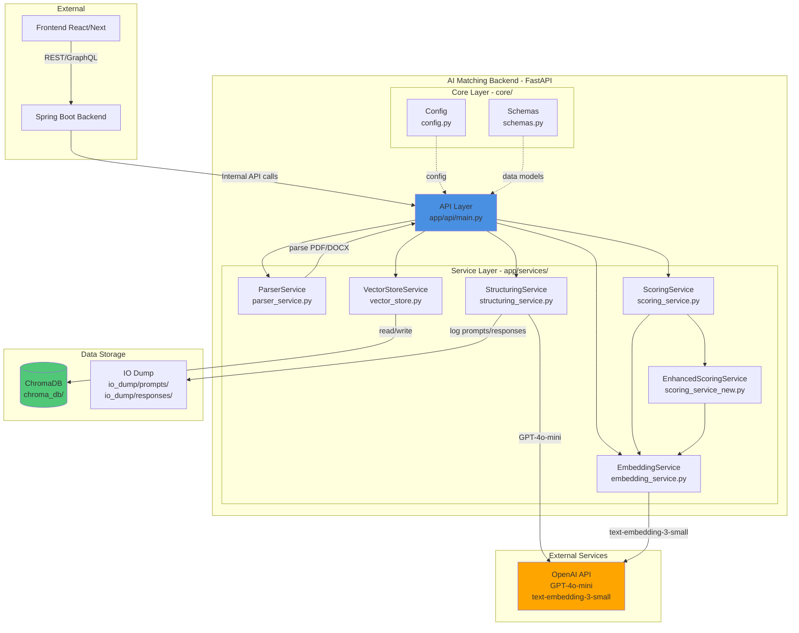

**API Endpoints:**

- `POST /process/cv` - Upload và xử lý CV (PDF/DOCX)
- `POST /process/jd` - Xử lý Job Description (text)
- `GET /match/{cv_id}/{jd_id}` - So khớp CV với JD và trả về điểm số

### Giải thích chi tiết:

**Kiến trúc Microservices:**

- Hệ thống được chia thành 3 tầng chính: **External** (Frontend + Spring Boot), **AI Matching Backend** (FastAPI), và **Data Storage** (ChromaDB + IO Dump).
- Spring Boot đóng vai trò là gateway nhận request từ Frontend, xác thực người dùng, và điều phối các microservices bên trong.

**AI Matching Backend (FastAPI):**

- **API Layer** (`app/api/main.py`): Cung cấp 3 RESTful endpoints chính, nhận request từ Spring Boot, validate input và orchestrate các services.
- **Service Layer**: 6 services độc lập xử lý từng nhiệm vụ cụ thể:
  - `ParserService`: Trích xuất text từ PDF/DOCX bằng pdfplumber và python-docx
  - `StructuringService`: Gọi GPT-4o-mini để chuyển text thô thành structured JSON theo schema
  - `EmbeddingService`: Tạo vector 1536 chiều bằng text-embedding-3-small
  - `VectorStoreService`: Quản lý ChromaDB collections (cv_collection, jd_collection)
  - `ScoringService`: Public interface cho scoring logic
  - `EnhancedScoringService`: Implementation chi tiết của hệ thống chấm điểm 6 hạng mục
- **Core Layer**: Config quản lý biến môi trường (OpenAI API key), Schemas định nghĩa Pydantic models cho validation

**Data Storage:**

- **ChromaDB** (`./chroma_db/`): Vector database lưu embeddings và metadata của CV/JD, persistent trên disk
- **IO Dump** (`./io_dump/`): Lưu prompts/responses từ OpenAI để audit, debug và potential fine-tuning

**Luồng hoạt động:**

1. Spring Boot gọi `/process/cv` hoặc `/process/jd` → FastAPI xử lý → trả về `doc_id`
2. Spring Boot lưu `doc_id` vào database nghiệp vụ
3. Khi cần matching, Spring Boot gọi `/match/{cv_id}/{jd_id}` → FastAPI load từ ChromaDB → tính điểm → trả về kết quả
4. StructuringService và EmbeddingService gọi OpenAI API, có retry logic và error handling
5. Mọi prompt/response được log vào `io_dump/` với timestamp để truy vết

**Bảo mật & Hiệu năng:**

- Internal API calls giữa Spring Boot và FastAPI được bảo vệ bằng JWT/mTLS
- ChromaDB sử dụng PersistentClient để dữ liệu không bị mất khi restart
- Services có thể scale độc lập theo load (horizontal scaling với Kubernetes HPA)

---

## 2. Luồng Xử lý API - Ba Endpoint Chính

### 2.1 POST /process/cv - Xử lý CV

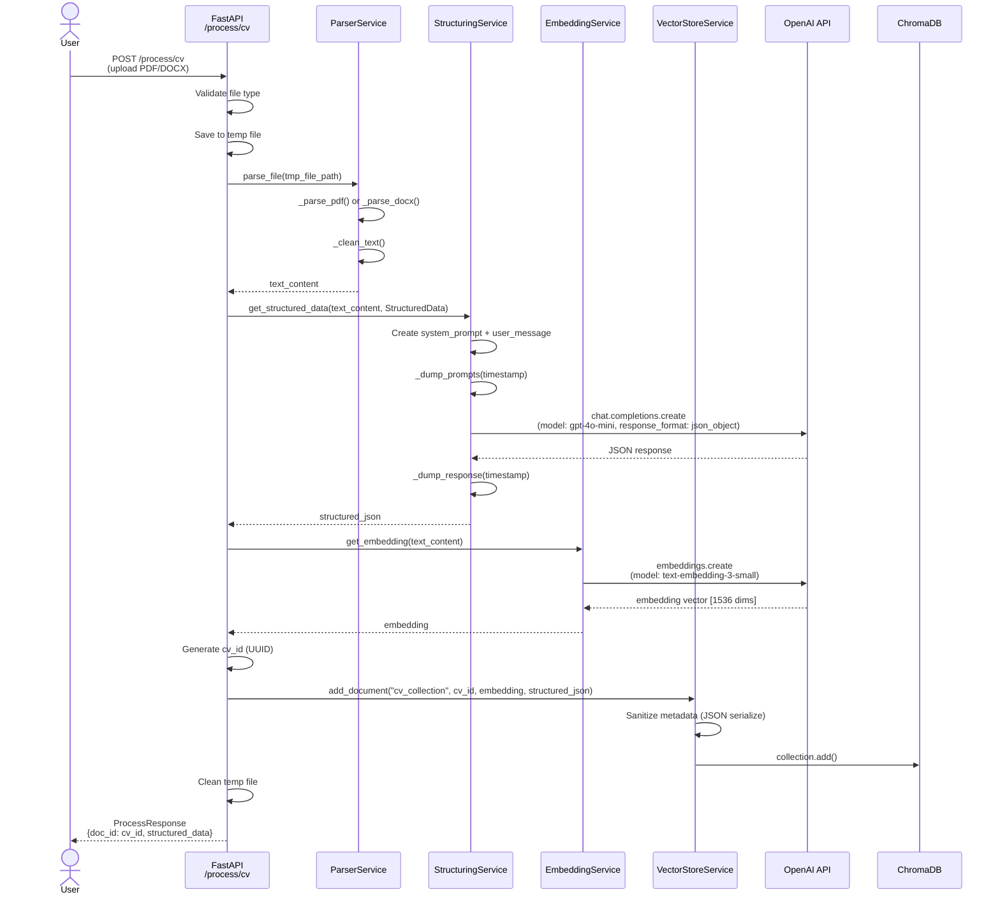

### 2.2 POST /process/jd - Xử lý Job Description

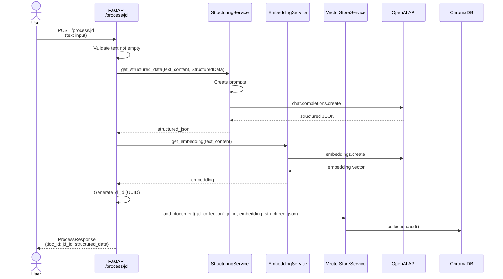

### 2.3 GET /match/{cv_id}/{jd_id} - So khớp CV-JD

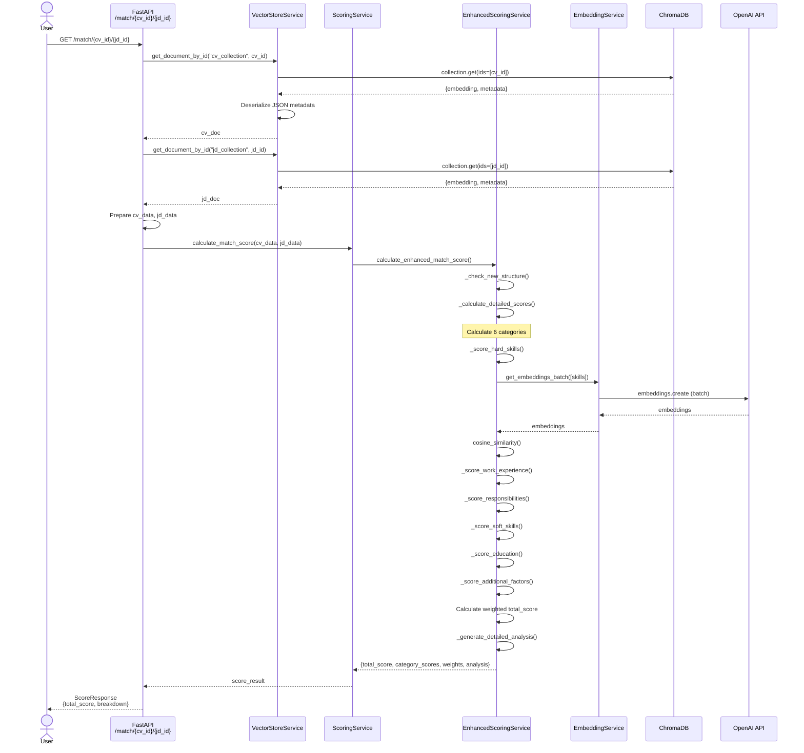

### Giải thích chi tiết các endpoint:

#### 2.1 POST /process/cv - Quy trình xử lý CV:

**Bước 1: Validation & Parse (lines 59-79 trong main.py)**

- API validate file extension (chỉ chấp nhận `.pdf` và `.docx`), kiểm tra tên file không rỗng
- Lưu file upload vào temp file với `tempfile.NamedTemporaryFile` để xử lý
- `ParserService.parse_file()` gọi `pdfplumber` (cho PDF) hoặc `python-docx` (cho DOCX)
- `_clean_text()` loại bỏ khoảng trắng thừa, dòng trống liên tiếp để chuẩn hóa text

**Bước 2: Structuring với GPT-4o-mini (lines 82-85 trong main.py)**

- `StructuringService` tạo system prompt chi tiết từ Pydantic schema `StructuredData`
- Prompt hướng dẫn model trích xuất 6 categories (hard_skills, work_experience, responsibilities, soft_skills, education, additional_factors)
- Gọi OpenAI với `response_format={"type": "json_object"}` và `temperature=0.1` để đảm bảo output nhất quán
- Lưu prompt vào `io_dump/prompts/prompt_{timestamp}.json` và response vào `io_dump/responses/response_{timestamp}.json`

**Bước 3: Embedding (lines 88 trong main.py)**

- `EmbeddingService` gọi OpenAI `text-embedding-3-small` model
- Trả về vector 1536 chiều biểu diễn semantic meaning của toàn bộ CV

**Bước 4: Vector Storage (lines 91-100 trong main.py)**

- Generate UUID cho cv_id
- `VectorStoreService.add_document()` serialize metadata (chuyển list/dict thành JSON string vì ChromaDB chỉ chấp nhận scalar types)
- Lưu vào collection `cv_collection` với embedding + metadata
- ChromaDB sử dụng HNSW index để tìm kiếm vector hiệu quả

**Output**: Trả về `ProcessResponse` chứa `doc_id` (UUID) và `structured_data` (đã parse thành Pydantic object) để Spring Boot lưu vào DB nghiệp vụ

#### 2.2 POST /process/jd - Quy trình xử lý Job Description:

**Khác biệt với /process/cv:**

- Nhận input là raw text (không cần parse file)
- Validate text không rỗng
- Lưu vào collection `jd_collection` thay vì `cv_collection`
- Logic structuring và embedding giống hệt /process/cv

**Use case**: Recruiter paste JD từ website tuyển dụng hoặc nhập trực tiếp vào form

#### 2.3 GET /match/{cv_id}/{jd_id} - Quy trình matching:

**Bước 1: Load Documents (lines 186-193 trong main.py)**

- `VectorStoreService.get_document_by_id()` query ChromaDB theo ID
- Deserialize JSON metadata về Python dict/list
- Kiểm tra document tồn tại, throw HTTPException 404 nếu không tìm thấy

**Bước 2: Scoring Pipeline (lines 196-207 trong main.py)**

- `ScoringService.calculate_match_score()` là public interface
- Delegate sang `EnhancedScoringService.calculate_enhanced_match_score()`
- `_check_new_structure()` verify data có đủ 6 categories (hard_skills, work_experience, etc.)
- `_calculate_detailed_scores()` tính điểm cho từng category:
  - **Hard Skills (30%)**: Batch embeddings cho tất cả skills, tính cosine similarity matrix, lấy max similarity cho mỗi JD skill, weighted average theo importance
  - **Work Experience (25%)**: Match job titles (40%), industries (30%), years (30%) với logic proportional
  - **Responsibilities (15%)**: Match key responsibilities (60%), achievements bonus (20%), project types (20%)
  - **Soft Skills (10%)**: Semantic match với fallback 0.5 nếu CV không ghi rõ
  - **Education (5%)**: Match degrees (50%), majors (30%), có additional courses thì bonus (20%)
  - **Additional Factors (15%)**: Languages (40%), availability (30%), relocation (30%)

**Bước 3: Analysis Generation**

- `_generate_detailed_analysis()` tạo text giải thích: strengths (CV có gì), gaps (thiếu gì), recommendations (nên học gì)
- Ví dụ: "Missing skills: Docker, Kubernetes" → "Consider acquiring: Docker, Kubernetes"

**Output**: `ScoreResponse` với `total_score` (float 0-1) và `breakdown` (dict chứa điểm từng category)

**Performance Notes:**

- Matching endpoint có thể gọi OpenAI API để batch embed skills (khi tính hard_skills score)
- Fallback sang `_simple_match_score` (exact string matching) nếu embedding fails
- Response time trung bình: 2-5 giây (phụ thuộc vào số lượng skills cần embed)

---

## 3. Cấu trúc Data Schema (core/schemas.py)

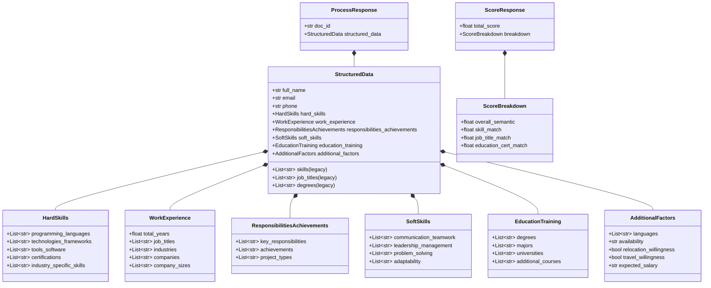

### Giải thích chi tiết:

**StructuredData - Schema chính (lines 133-183 trong schemas.py):**

- Đây là Pydantic model chính định nghĩa cấu trúc dữ liệu cho cả CV và JD
- Được chia thành **6 categories** tương ứng với hệ thống chấm điểm:
  1. `HardSkills` (30% weight): Technical skills chia thành 5 nhóm con
  2. `WorkExperience` (25% weight): Kinh nghiệm làm việc, job titles, industries
  3. `ResponsibilitiesAchievements` (15% weight): Nhiệm vụ, thành tích
  4. `SoftSkills` (10% weight): 4 nhóm soft skills
  5. `EducationTraining` (5% weight): Học vấn, chuyên ngành
  6. `AdditionalFactors` (15% weight): Ngôn ngữ, availability, relocation
- **Legacy fields** (skills, job_titles, degrees) được giữ lại để backward compatibility

**HardSkills - Category quan trọng nhất (lines 5-26):**

- `programming_languages`: Python, Java, C++, JavaScript, ...
- `technologies_frameworks`: React, Django, TensorFlow, Docker, Kubernetes, ...
- `tools_software`: Git, Jira, VS Code, Figma, ...
- `certifications`: AWS Certified, PMP, CKA, ...
- `industry_specific_skills`: Real-time systems, HIPAA compliance, Financial modeling, ...

**Tại sao chia nhỏ thành 5 sub-categories?**

- Áp dụng **weighted scoring** (lines 138-144 trong scoring_service_new.py): programming_languages (2.0), frameworks (1.5), tools (1.0), certs (1.2), industry (1.3)
- Core skills (programming) quan trọng hơn supporting tools
- Certifications cho thấy commitment và formal training

**WorkExperience - Đánh giá kinh nghiệm (lines 29-51):**

- `total_years`: Số năm kinh nghiệm (float để xử lý "2.5 years")
- `job_titles`: Software Engineer, Senior Data Scientist, Product Manager, ...
- `industries`: Fintech, Healthcare, E-commerce, ...
- `companies`: Google, startup XYZ, ...
- `company_sizes`: Startup (<50), SME (50-500), Enterprise (>500)

**ResponsibilitiesAchievements - Đánh giá chi tiết công việc (lines 53-67):**

- `key_responsibilities`: "Led team of 5 engineers", "Designed microservices architecture", ...
- `achievements`: "Reduced latency by 40%", "Increased user engagement 2x", ...
- `project_types`: Web applications, Mobile apps, Data pipelines, ML models, ...

**SoftSkills - Skills khó đo lường (lines 69-87):**

- Thường không được ghi rõ trong CV nên có **fallback score 0.5** (line 268 trong scoring_service_new.py)
- Chia thành 4 nhóm để semantic matching chính xác hơn
- Ví dụ: "Team player", "Excellent communication" → `communication_teamwork`

**EducationTraining - Nền tảng học thuật (lines 89-107):**

- `degrees`: Bachelor, Master, PhD, ...
- `majors`: Computer Science, Data Science, Software Engineering, ...
- `universities`: MIT, Stanford, PTIT, ...
- `additional_courses`: Coursera certificates, bootcamps → **bonus 20%** (line 292 trong scoring_service_new.py)

**AdditionalFactors - Yếu tố phụ trợ (lines 109-131):**

- `languages`: ["English: Fluent", "Vietnamese: Native", "Japanese: Basic"]
- `availability`: "Immediate", "1 month notice", "2 months"
- `relocation_willingness`: True/False → quan trọng nếu JD yêu cầu
- `expected_salary`: Optional, để tham khảo (không ảnh hưởng matching score)

**API Response Models:**

- `ProcessResponse`: Trả về sau khi process CV/JD, chứa `doc_id` (UUID) và `structured_data`
- `ScoreResponse`: Trả về sau matching, chứa `total_score` (0-1) và `breakdown` (điểm từng category)
- `ScoreBreakdown`: Legacy structure, hiện tại sử dụng dict với 6 keys (hard_skills, work_experience, ...)

**Validation với Pydantic:**

- Tự động validate types (str, List[str], float, bool)
- `Field(default_factory=list)` để empty list nếu không có data
- `Optional[...]` cho nullable fields
- Model có thể serialize/deserialize JSON dễ dàng với `.model_dump()` và `.model_validate()`

---

## 4. Hệ thống Chấm điểm 6 Hạng mục (scoring_service_new.py)

```mermaid
graph TB
    subgraph "EnhancedScoringService"
        START[calculate_enhanced_match_score]

        START --> CHECK[_check_new_structure]
        CHECK --> CALC[_calculate_detailed_scores]

        subgraph "6 Categories with Weights"
            CALC --> HS[_score_hard_skills<br/>Weight: 30%]
            CALC --> WE[_score_work_experience<br/>Weight: 25%]
            CALC --> RS[_score_responsibilities<br/>Weight: 15%]
            CALC --> SS[_score_soft_skills<br/>Weight: 10%]
            CALC --> ED[_score_education<br/>Weight: 5%]
            CALC --> AF[_score_additional_factors<br/>Weight: 15%]
        end

        HS --> TOTAL[Calculate total_score]
        WE --> TOTAL
        RS --> TOTAL
        SS --> TOTAL
        ED --> TOTAL
        AF --> TOTAL

        TOTAL --> ANALYSIS[_generate_detailed_analysis]
        ANALYSIS --> RESULT[Return Result]
    end

    subgraph "Scoring Logic Details"
        HS --> HS1[Group skills by category<br/>programming, frameworks, tools, certs]
        HS1 --> HS2[Apply internal weights<br/>2.0, 1.5, 1.0, 1.2, 1.3]
        HS2 --> HS3[Batch embeddings]
        HS3 --> HS4[Cosine similarity matrix]
        HS4 --> HS5[Max similarity per JD skill]
        HS5 --> HS6[Weighted average]

        WE --> WE1[Job title match: 40%]
        WE --> WE2[Industry match: 30%]
        WE --> WE3[Years of experience: 30%<br/>Proportional if less]

        RS --> RS1[Key responsibilities: 60%]
        RS --> RS2[Achievements bonus: 20%]
        RS --> RS3[Project types: 20%]

        SS --> SS1[Communication/Teamwork]
        SS --> SS2[Leadership/Management]
        SS --> SS3[Problem Solving]
        SS --> SS4[Adaptability]
        SS --> SS5[Fallback 0.5 if CV empty but JD requires]

        ED --> ED1[Degrees: 50%]
        ED --> ED2[Majors: 30%]
        ED --> ED3[Additional courses bonus: 20%]

        AF --> AF1[Languages: 40%]
        AF --> AF2[Availability: 30%]
        AF --> AF3[Relocation willingness: 30%]
    end

    style HS fill:#FF6B6B
    style WE fill:#4ECDC4
    style RS fill:#45B7D1
    style SS fill:#96CEB4
    style ED fill:#FFEAA7
    style AF fill:#DFE6E9
    style TOTAL fill:#6C5CE7
```

### Giải thích chi tiết:

**EnhancedScoringService - Core Scoring Engine (lines 11-398 trong scoring_service_new.py):**

**Trọng số 6 categories (lines 32-39):**

```python
{
    "hard_skills": 0.30,          # 30% - Quan trọng nhất
    "work_experience": 0.25,       # 25% - Kinh nghiệm thực tế
    "responsibilities": 0.15,      # 15% - Chi tiết công việc
    "soft_skills": 0.10,           # 10% - Khó đo lường
    "education": 0.05,             # 5% - Nền tảng
    "additional_factors": 0.15     # 15% - Logistics factors
}
```

Tổng = 100%, đảm bảo final score trong khoảng [0, 1]

**Pipeline chấm điểm (lines 41-76):**

1. `_check_new_structure()`: Verify data có đủ 6 categories, throw error nếu thiếu
2. `_calculate_detailed_scores()`: Gọi 6 scoring methods song song
3. Weighted sum: `Σ(score_i × weight_i)`
4. `_generate_detailed_analysis()`: Phân tích strengths/gaps/recommendations

**Hard Skills Scoring - Chi tiết nhất (lines 124-179):**

- **Internal weights**: programming (2.0), frameworks (1.5), tools (1.0), certs (1.2), industry (1.3)
- **Batch embeddings**: Gọi OpenAI 1 lần cho tất cả skills (lines 153-159) → tối ưu performance
- **Cosine similarity matrix**: JD skills × CV skills
- **Max matching**: Mỗi JD skill lấy CV skill giống nhất (line 168)
- **Weighted average**: Nhân với internal weights, chia cho tổng weights
- **Fallback**: Nếu embedding fails → `_simple_match_score` (exact string matching, lines 353-364)

**Work Experience Scoring - 3 thành phần (lines 181-214):**

- **Job titles (40%)**: Semantic match với `_semantic_list_match()` (lines 187-190)
  - "Software Engineer" vs "Senior SWE" → similarity ~0.85
- **Industry (30%)**: Simple match (Fintech = Fintech) (lines 193-197)
- **Years (30%)**: Proportional scoring (lines 200-206)
  - CV: 3 years, JD requires: 5 years → score = 3/5 = 0.6
  - CV: 7 years, JD requires: 5 years → score = min(1.0, 7/5) = 1.0

**Responsibilities Scoring - Đánh giá công việc (lines 216-246):**

- **Key responsibilities (60%)**: Semantic match các nhiệm vụ chính
- **Achievements (20%)**: Bonus nếu CV có achievements dù JD không yêu cầu → điểm 1.0
- **Project types (20%)**: Simple match loại dự án

**Soft Skills Scoring - Fallback logic (lines 248-269):**

- Gom 4 categories thành 1 list
- Semantic match giữa CV và JD
- **Fallback 0.5**: Nếu CV không ghi soft skills nhưng JD yêu cầu → không cho 0.0 (quá harsh)

**Education Scoring - Thấp nhất (lines 271-298):**

- **Degrees (50%)**: Bachelor, Master, PhD → simple match
- **Majors (30%)**: Computer Science vs Software Engineering → semantic match
- **Additional courses (20%)**: Nếu có thêm khóa học → bonus 1.0 × 0.2 = 0.2 điểm

**Additional Factors Scoring - Logistics (lines 300-330):**

- **Languages (40%)**: Match required languages
- **Availability (30%)**: "Immediate" > "1 month" → score 1.0 vs 0.7
- **Relocation (30%)**: Boolean match (JD requires = CV willing → 1.0)

**Detailed Analysis Generation (lines 366-397):**

- **Strengths**: Số lượng technical skills, có achievements, ...
- **Gaps**: Missing skills (lấy 5 skills đầu tiên)
- **Recommendations**: "Consider acquiring: Docker, Kubernetes, CI/CD"

**Performance & Robustness:**

- Try-except ở mỗi scoring method
- Fallback sang simple matching nếu embedding fails
- Batch embeddings giảm số lần gọi OpenAI API
- Response time: 2-5 giây (phụ thuộc số skills cần embed)

---

## 5. Chi tiết Logic Chấm điểm Hard Skills

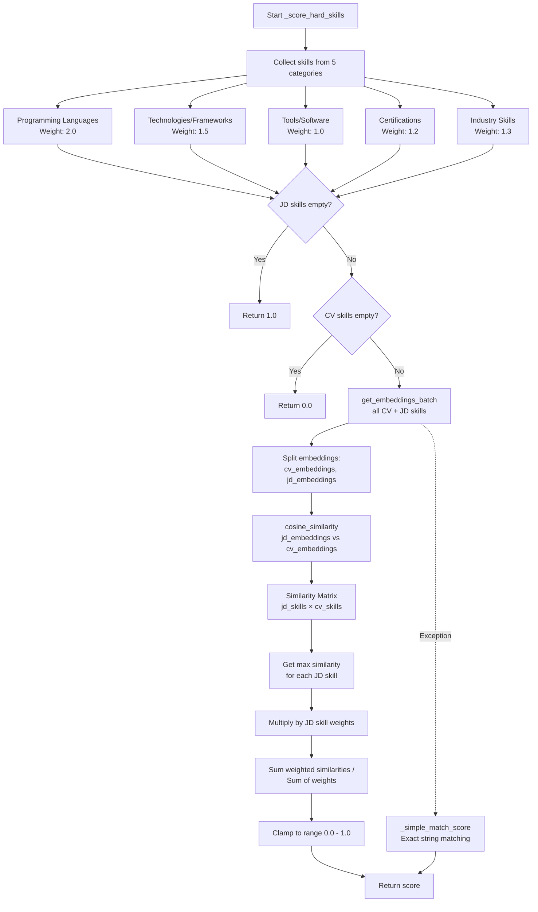

### Giải thích chi tiết:

**Luồng xử lý \_score_hard_skills() - Method phức tạp nhất (lines 124-179 trong scoring_service_new.py):**

**Step 1: Collect & Weight Skills (lines 128-145)**

```python
skill_categories = [
    ("programming_languages", 2.0),      # Core skills - weight cao nhất
    ("technologies_frameworks", 1.5),    # Frameworks quan trọng
    ("tools_software", 1.0),             # Tools ít quan trọng hơn
    ("certifications", 1.2),             # Certifications shows commitment
    ("industry_specific_skills", 1.3)    # Domain knowledge
]
```

- Mỗi skill được gán weight dựa trên importance
- Ví dụ: Python (2.0) quan trọng hơn Git (1.0)

**Step 2: Edge Cases (lines 146-149)**

- Nếu JD không yêu cầu skills → return 1.0 (perfect match)
- Nếu CV không có skills nhưng JD yêu cầu → return 0.0 (no match)

**Step 3: Batch Embeddings (lines 153-162)**

```python
all_skills = cv_skill_names + jd_skill_names
embeddings = self.embedding_service.get_embeddings_batch(all_skills)
```

- Gộp tất cả skills thành 1 list
- Gọi OpenAI API **1 lần duy nhất** (thay vì N lần) → tiết kiệm thời gian và chi phí
- Ví dụ: ["Python", "Java", "React", "Docker", ...] → [[emb1], [emb2], [emb3], [emb4], ...]

**Step 4: Split Embeddings (line 161-162)**

```python
cv_embeddings = embeddings[:len(cv_skill_names)]   # First N embeddings
jd_embeddings = embeddings[len(cv_skill_names):]   # Remaining embeddings
```

**Step 5: Cosine Similarity Matrix (line 165)**

```python
similarity_matrix = cosine_similarity(jd_embeddings, cv_embeddings)
```

- Matrix kích thước: `(num_jd_skills × num_cv_skills)`
- Ví dụ:

```
              Python  Java  React  Docker
Django        0.65    0.32  0.15   0.10
FastAPI       0.72    0.28  0.18   0.12
PostgreSQL    0.35    0.30  0.10   0.45
```

**Step 6: Max Similarity Per JD Skill (line 168)**

```python
max_similarities = np.max(similarity_matrix, axis=1)
```

- Mỗi JD skill lấy CV skill match nhất
- Django → Python (0.65), FastAPI → Python (0.72), PostgreSQL → Docker (0.45)

**Step 7: Weighted Average (lines 169-172)**

```python
weighted_similarities = max_similarities * jd_weights
score = sum(weighted_similarities) / sum(jd_weights)
```

- Nhân với weights: Django (2.0), FastAPI (1.5), PostgreSQL (1.0)
- Tính weighted average
- Clamp vào [0.0, 1.0]

**Step 8: Exception Handling (lines 174-179)**

- Nếu OpenAI API fails (network error, rate limit, ...)
- Fallback sang `_simple_match_score`: exact string matching (lowercase)
- Đảm bảo hệ thống luôn trả về kết quả

**Ví dụ thực tế:**

**CV Skills:**

- Python (weight 2.0)
- Django (weight 1.5)
- PostgreSQL (weight 1.0)
- Git (weight 1.0)

**JD Requirements:**

- Python (weight 2.0)
- FastAPI (weight 1.5)
- Redis (weight 1.3)
- Docker (weight 1.0)

**Matching:**

1. Python → Python: similarity = 1.0 (exact)
2. FastAPI → Django: similarity = 0.75 (similar frameworks)
3. Redis → PostgreSQL: similarity = 0.60 (both databases)
4. Docker → Git: similarity = 0.30 (both dev tools but different)

**Score Calculation:**

```
weighted_sum = (1.0×2.0 + 0.75×1.5 + 0.60×1.3 + 0.30×1.0) = 4.205
total_weight = (2.0 + 1.5 + 1.3 + 1.0) = 5.8
final_score = 4.205 / 5.8 = 0.725 (72.5%)
```

**Tại sao không dùng simple exact matching?**

- "FastAPI" vs "Fast API" → exact match fails
- "Kubernetes" vs "K8s" → exact match fails
- Semantic similarity giải quyết typos, abbreviations, synonyms

---

## 6. Service Dependencies

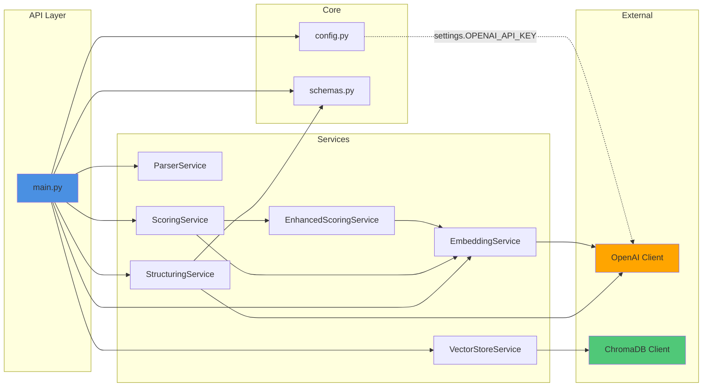

### Giải thích chi tiết:

**Dependency Injection Pattern:**

- `main.py` khởi tạo tất cả services với dependencies (lines 23-31)
- `OpenAI Client` được inject vào `StructuringService` và `EmbeddingService`
- `ChromaDB Client` được khởi tạo trong `VectorStoreService.__init__()`
- Services độc lập, dễ test với mocking

**Service Orchestration:**

- `main.py` (API Layer) orchestrate workflow: parse → structure → embed → store
- Mỗi service có single responsibility:
  - `ParserService`: File I/O only
  - `StructuringService`: OpenAI GPT-4o-mini calls only
  - `EmbeddingService`: OpenAI embeddings calls only
  - `VectorStoreService`: ChromaDB operations only
  - `ScoringService`: Public interface
  - `EnhancedScoringService`: Scoring logic implementation

**Scoring Service Hierarchy:**

- `ScoringService` là wrapper (lines 7-37 trong scoring_service.py)
- Delegate sang `EnhancedScoringService` cho actual logic
- Tách biệt public API và implementation → dễ thay đổi scoring algorithm

**Config Management:**

- `config.py` sử dụng Pydantic Settings (lines 6-13 trong config.py)
- Load từ `config.env` file
- `settings.OPENAI_API_KEY` được inject vào OpenAI client
- Environment variables: `OPENAI_API_KEY` (required)

**Schema Usage:**

- `schemas.py` định nghĩa Pydantic models
- `StructuringService` sử dụng schema để generate prompt (line 33 trong structuring_service.py)
- API endpoints sử dụng schema cho request/response validation

**External Dependencies:**

- **OpenAI Client**: Shared giữa StructuringService và EmbeddingService để reuse connection pooling
- **ChromaDB Client**: PersistentClient với `./chroma_db/` path, auto-persist data

**Tại sao tách services?**

- **Testability**: Mock từng service riêng biệt
- **Maintainability**: Thay đổi 1 service không ảnh hưởng services khác
- **Scalability**: Có thể tách services thành separate microservices nếu cần
- **Reusability**: `EmbeddingService` được dùng bởi cả API và ScoringService

---

## 7. Data Flow - Từ File Upload đến Matching Result

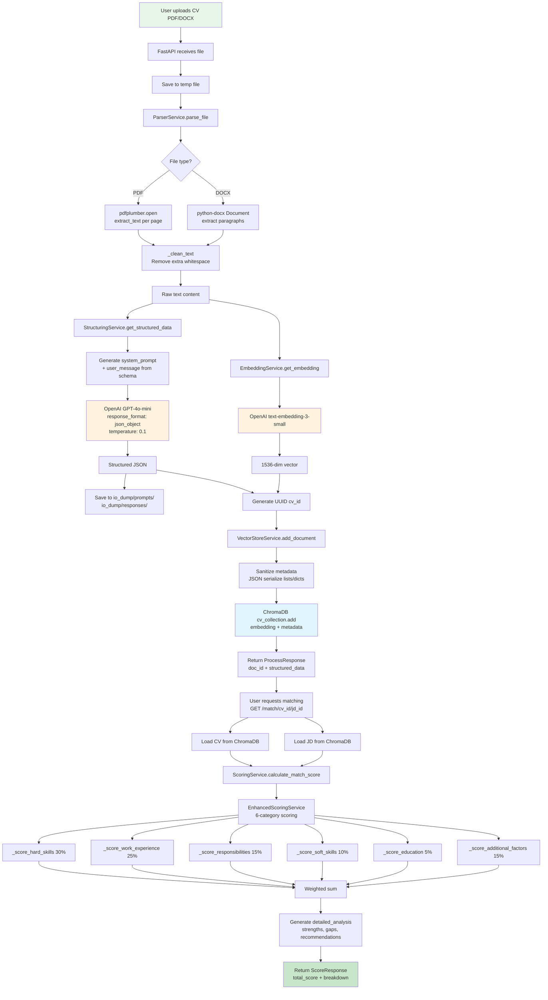

### Giải thích chi tiết:

**Complete Pipeline - Từ File đến Matching Score:**

**Phase 1: File Processing (Upload → Text Extraction)**

1. User upload CV file (PDF/DOCX) qua FastAPI endpoint
2. API validate file type, size, MIME type
3. Save to temp file với `tempfile.NamedTemporaryFile` (auto-cleanup)
4. `pdfplumber` hoặc `python-docx` extract text từng page/paragraph
5. `_clean_text()` normalize whitespace, remove empty lines

**Phase 2: Structuring (Text → JSON)** 6. `StructuringService` generate system prompt từ Pydantic schema 7. Prompt instructions: extract 6 categories với examples và guidelines 8. Call GPT-4o-mini với `temperature=0.1` (deterministic), `response_format=json_object` 9. Log prompt/response vào `io_dump/` với timestamp (YYYYMMDD_HHMMSS_microsec) 10. Parse JSON, validate against schema

**Phase 3: Embedding (Text → Vector)** 11. `EmbeddingService` call OpenAI `text-embedding-3-small` 12. Input: full text content (không phải structured JSON) 13. Output: 1536-dimensional vector representing semantic meaning 14. Vector này dùng cho similarity search (nếu cần) và làm feature cho matching

**Phase 4: Storage (Vector + Metadata → ChromaDB)** 15. Generate UUID for cv_id 16. Sanitize metadata: JSON.dumps() cho list/dict fields 17. ChromaDB collection.add(): lưu (id, embedding, metadata) 18. Data persist to disk (`./chroma_db/chroma.sqlite3` + HNSW index files)

**Phase 5: Matching Request** 19. User/Spring Boot gọi `/match/{cv_id}/{jd_id}` 20. API load CV và JD documents từ ChromaDB theo IDs 21. Deserialize JSON strings trong metadata về Python objects

**Phase 6: Scoring (6 Categories)**
22-27. EnhancedScoringService tính điểm cho 6 categories:

- Hard Skills: Batch embed, cosine similarity matrix, weighted average
- Work Experience: Job title semantic match + industry + years proportional
- Responsibilities: Semantic match responsibilities + achievements bonus
- Soft Skills: Semantic match với fallback 0.5
- Education: Degree match + major semantic + courses bonus
- Additional Factors: Languages + availability + relocation

**Phase 7: Aggregation** 28. Weighted sum: `Σ(score_i × weight_i)` 29. Generate detailed_analysis: strengths, gaps, recommendations

**Phase 8: Response** 30. Return `ScoreResponse` với `total_score` (0-1) và `breakdown` (dict)

**Parallel Operations:**

- Embedding và Structuring có thể chạy parallel (nhưng code hiện tại chạy sequential)
- Batch embeddings trong scoring giúp giảm latency

**Error Handling:**

- Temp file được cleanup trong finally block
- Try-except ở mỗi service call
- Fallback mechanisms (simple matching nếu embedding fails)

**Performance:**

- Total time: ~5-10 giây cho /process/cv (GPT-4o-mini ~2s, embedding ~1s)
- Total time: ~3-5 giây cho /match (phụ thuộc số skills cần embed)
- Có thể optimize bằng caching embeddings của skills phổ biến (Python, Java, ...)

---

## 8. ChromaDB Storage Structure

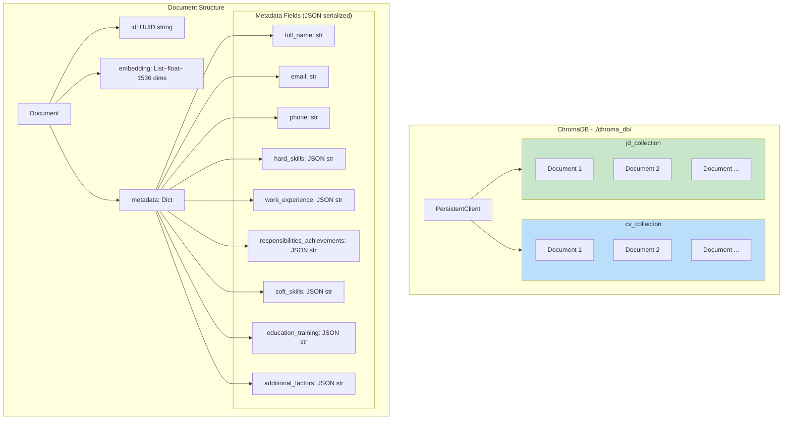

### Giải thích chi tiết:

**ChromaDB Architecture (lines 10-21 trong vector_store.py):**

**PersistentClient Configuration:**

```python
self.client = chromadb.PersistentClient(
    path="./chroma_db",
    settings=ChromaSettings(anonymized_telemetry=False)
)
```

- Data persist trên disk, không bị mất khi restart service
- SQLite database (`chroma.sqlite3`) lưu metadata
- HNSW index files lưu embeddings cho fast similarity search

**Two Collections:**

- **cv_collection**: Chứa tất cả CV documents
- **jd_collection**: Chứa tất cả JD documents
- Tách biệt để query và manage dễ dàng

**Document Structure:**

1. **id**: UUID string (cv_id hoặc jd_id)
   - Generated bởi Python `uuid.uuid4()`
   - Unique identifier cho mỗi document
2. **embedding**: List[float] với 1536 dimensions
   - OpenAI text-embedding-3-small output
   - Dùng cho similarity search (nếu cần top-k similar CVs/JDs)
   - Lưu dưới dạng binary trong HNSW index
3. **metadata**: Dict chứa structured data
   - **Constraint**: ChromaDB chỉ chấp nhận scalar types (str, int, float, bool)
   - **Solution**: JSON.dumps() cho nested structures (lines 48-58 trong vector_store.py)

**Metadata Serialization (lines 48-58):**

```python
for key, value in metadata.items():
    if isinstance(value, (list, dict)):
        sanitized_metadata[key] = json.dumps(value, ensure_ascii=False)
    elif value is None:
        continue  # Skip None values
    else:
        sanitized_metadata[key] = value
```

**Metadata Fields:**

- `full_name`, `email`, `phone`: Lưu trực tiếp (str)
- `hard_skills`, `work_experience`, ...: JSON string
  - Ví dụ: `'{"programming_languages": ["Python", "Java"], ...}'`

**Retrieval & Deserialization (lines 86-100):**

```python
for key, value in raw_metadata.items():
    if isinstance(value, str):
        try:
            deserialized_metadata[key] = json.loads(value)
        except (json.JSONDecodeError, TypeError):
            deserialized_metadata[key] = value  # Keep as string
```

- Tự động detect JSON strings và parse về dict/list
- Fallback sang plain string nếu không phải JSON

**Storage on Disk:**

```
chroma_db/
├── chroma.sqlite3                  # Metadata database
├── {collection-uuid}/
│   ├── data_level0.bin             # HNSW index
│   ├── header.bin
│   ├── length.bin
│   └── link_lists.bin
```

**Query Operations:**

- `get_document_by_id()`: O(1) lookup by UUID
- `query()`: Vector similarity search với HNSW
- `collection.count()`: Số documents trong collection

**Why ChromaDB?**

- **Lightweight**: Không cần separate vector DB server (như Milvus, Pinecone)
- **Persistent**: Data saved locally
- **Fast**: HNSW index cho nearest neighbor search
- **Python-native**: Dễ integrate với FastAPI

**Scalability:**

- Hiện tại: Single-node ChromaDB (đủ cho <100K documents)
- Tương lai: Có thể migrate sang Chroma Server Mode hoặc Pinecone/Weaviate cho distributed setup

---

## 9. IO Dump Structure - Audit Trail

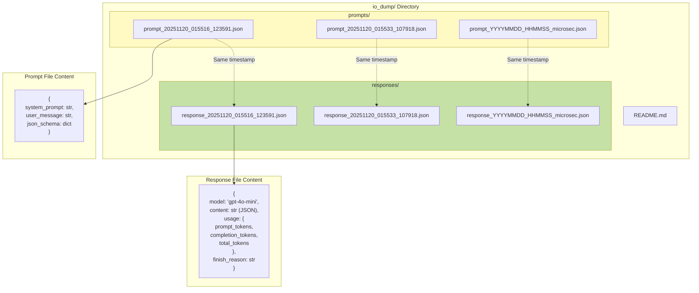

### Giải thích chi tiết:

**Purpose của IO Dump - Audit Trail & Debugging (lines 146-180 trong structuring_service.py):**

**Timestamp Format:**

- `YYYYMMDD_HHMMSS_microsec`: `20251120_015516_123591`
- Microseconds đảm bảo uniqueness ngay cả khi xử lý nhiều requests đồng thời
- Same timestamp cho prompt và response để dễ trace

**Prompt File Structure (lines 103-107):**

```json
{
  "system_prompt": "You are an expert in extracting...",
  "user_message": "Please analyze and extract...",
  "json_schema": {
    "properties": {...},
    "required": [...],
    ...
  }
}
```

- `system_prompt`: Toàn bộ instructions cho GPT-4o-mini
- `user_message`: Text content cần extract
- `json_schema`: Pydantic schema converted to JSON để trace

**Response File Structure (lines 125-134):**

```json
{
  "model": "gpt-4o-mini",
  "content": "{\"full_name\": \"...\", \"hard_skills\": {...}}",
  "usage": {
    "prompt_tokens": 1250,
    "completion_tokens": 850,
    "total_tokens": 2100
  },
  "finish_reason": "stop"
}
```

- `model`: Actual model used (may differ if fallback)
- `content`: Raw JSON string response
- `usage`: Token consumption → cost tracking
- `finish_reason`: "stop" (normal), "length" (truncated), "content_filter"

**Use Cases:**

1. **Debugging:**

   - Nếu structured JSON không đúng → xem prompt có clear không
   - Nếu thiếu fields → kiểm tra user_message có đủ thông tin không

2. **Audit & Compliance:**

   - Trace lại tất cả LLM calls cho regulatory requirements
   - Verify không có PII leakage trong prompts

3. **Fine-tuning Dataset:**

   - Collect prompt-response pairs
   - Filter high-quality examples
   - Fine-tune custom model để giảm dependency vào OpenAI

4. **Cost Analysis:**

   - Tổng tokens consumed per day/month
   - Average tokens per CV/JD
   - Optimize prompt để giảm tokens

5. **Performance Monitoring:**
   - Nếu response chậm → check token count có quá lớn không
   - A/B test different prompts

**Auto-cleanup Strategy:**

- Hiện tại: Files tích lũy vô hạn
- Recommended: Cron job xóa files >30 ngày hoặc archive lên S3
- Encryption: Nếu chứa sensitive data → encrypt at rest

**File Sizes:**

- Prompt: ~5-10 KB (schema lớn)
- Response: ~3-8 KB (structured JSON)
- 1000 requests = ~8-18 MB

**Implementation Notes (lines 146-180):**

- Try-except around file writes → không block main flow nếu disk full
- `ensure_ascii=False` → support Unicode (Vietnamese, Chinese names)
- `indent=2` → human-readable JSON

---

## 10. Error Handling Flow

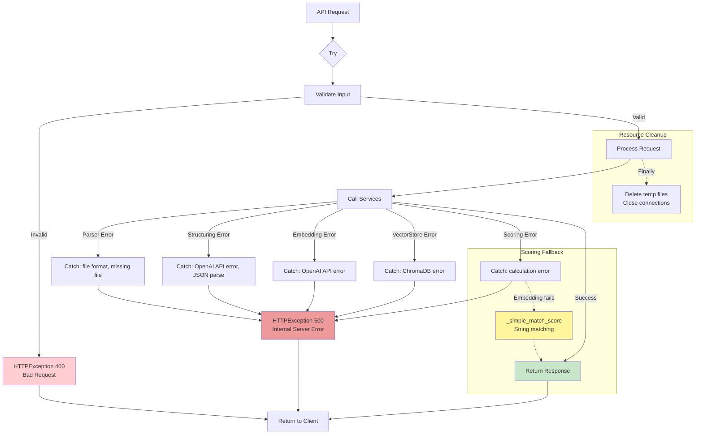

### Giải thích chi tiết:

**Error Handling Strategy - Defensive Programming:**

**Level 1: Input Validation (lines 60-69, 136 trong main.py)**

- **HTTP 400 Bad Request**:
  - Empty filename
  - Invalid file extension (not .pdf or .docx)
  - Empty JD text
  - File size quá lớn (có thể thêm)
- Return immediately với descriptive error message

**Level 2: Service-level Errors (lines 115-118, 166-169, 217-220)**

```python
try:
    # Process logic
except HTTPException:
    raise  # Re-raise HTTP exceptions
except Exception as e:
    raise HTTPException(status_code=500, detail=f"Lỗi khi xử lý: {str(e)}")
```

- **Parser Errors**: File corrupt, unsupported format
- **Structuring Errors**: OpenAI API timeout, rate limit, JSON parse fails
- **Embedding Errors**: OpenAI API errors
- **VectorStore Errors**: ChromaDB connection, disk full
- **Scoring Errors**: Division by zero, missing data

**Level 3: Graceful Fallbacks (lines 174-179 trong scoring_service_new.py)**

```python
try:
    # Batch embeddings + cosine similarity
    return semantic_score
except Exception:
    # Fallback to simple string matching
    return self._simple_match_score(cv_list, jd_list)
```

- **Hard Skills**: Semantic match fails → simple exact match
- **Soft Skills**: CV empty → fallback score 0.5
- Đảm bảo luôn trả về valid score [0, 1]

**Level 4: Resource Cleanup (lines 110-113 trong main.py)**

```python
finally:
    if os.path.exists(tmp_file_path):
        os.remove(tmp_file_path)
```

- Delete temp files ngay cả khi error
- Prevent disk space leak

**Error Response Format:**

```json
{
  "detail": "Lỗi khi xử lý CV: JSON parsing failed at line 42"
}
```

- Spring Boot có thể parse và display user-friendly message

**Logging Strategy:**

- Hiện tại: Chưa có structured logging
- Recommended:
  - `structlog` hoặc `python-json-logger`
  - Log levels: INFO (normal), WARNING (fallback used), ERROR (failed)
  - Correlation ID từ Spring Boot để trace end-to-end

**Retry Logic:**

- Hiện tại: Không có retry
- Recommended:
  - `tenacity` library cho OpenAI API calls
  - Exponential backoff: 1s, 2s, 4s
  - Max 3 retries
  - Retry on: RateLimitError, Timeout

**Circuit Breaker:**

- Nếu OpenAI API down → stop calling, return cached results hoặc error ngay
- Prevent cascading failures

**Monitoring & Alerting:**

- Track error rates per endpoint
- Alert if error rate > 5% trong 5 phút
- Alert if OpenAI API latency > 10s

**Example Error Scenarios:**

1. **Corrupt PDF**:

   - pdfplumber throws error → caught in try-except → HTTP 500
   - User sees: "Không thể đọc file PDF, vui lòng thử file khác"

2. **OpenAI Rate Limit**:

   - OpenAI returns 429 → caught → HTTP 500
   - User sees: "Hệ thống đang bận, vui lòng thử lại sau"

3. **Missing Skills Data**:

   - CV has no hard_skills → scoring returns 0.0 (not error)
   - Still return valid ScoreResponse

4. **ChromaDB Connection Loss**:
   - Collection.get() fails → caught → HTTP 500
   - User sees: "Không thể load dữ liệu, vui lòng thử lại"

---

## 11. Matching Score Calculation - Detailed Formula

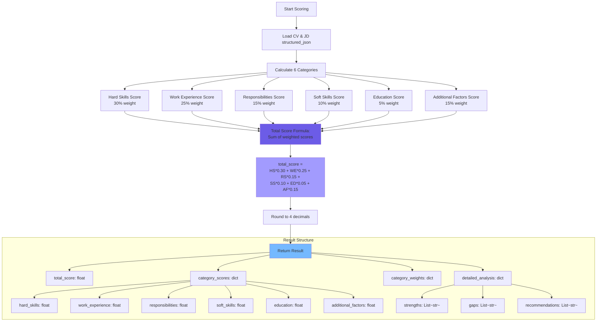

### Giải thích chi tiết:

**Matching Score Formula - Weighted Sum Approach (lines 64-75 trong scoring_service_new.py):**

**Step 1: Calculate Individual Scores**
Mỗi category trả về score trong khoảng [0.0, 1.0]:

```python
scores = {
    "hard_skills": 0.85,          # 85% match
    "work_experience": 0.70,      # 70% match
    "responsibilities": 0.60,     # 60% match
    "soft_skills": 0.50,          # 50% match (fallback)
    "education": 0.80,            # 80% match
    "additional_factors": 0.90    # 90% match
}
```

**Step 2: Apply Weights**

```python
weights = {
    "hard_skills": 0.30,          # 30%
    "work_experience": 0.25,      # 25%
    "responsibilities": 0.15,     # 15%
    "soft_skills": 0.10,          # 10%
    "education": 0.05,            # 5%
    "additional_factors": 0.15    # 15%
}
# Total = 1.0 (100%)
```

**Step 3: Weighted Sum**

```python
total_score = sum(scores[cat] * weights[cat] for cat in weights)
            = 0.85*0.30 + 0.70*0.25 + 0.60*0.15 + 0.50*0.10 + 0.80*0.05 + 0.90*0.15
            = 0.255 + 0.175 + 0.09 + 0.05 + 0.04 + 0.135
            = 0.745
```

**Step 4: Round to 4 Decimals**

```python
total_score = round(0.7450, 4) = 0.7450
```

**Result Structure:**

**1. total_score (float):**

- Range: [0.0, 1.0]
- Interpretation:
  - 0.9 - 1.0: Excellent match (>90%)
  - 0.8 - 0.9: Very good match (80-90%)
  - 0.7 - 0.8: Good match (70-80%)
  - 0.6 - 0.7: Fair match (60-70%)
  - < 0.6: Poor match (<60%)

**2. category_scores (dict):**

```json
{
  "hard_skills": 0.85,
  "work_experience": 0.7,
  "responsibilities": 0.6,
  "soft_skills": 0.5,
  "education": 0.8,
  "additional_factors": 0.9
}
```

- Frontend hiển thị radar chart với 6 axes
- Highlight categories có điểm thấp (< 0.6) bằng màu đỏ

**3. category_weights (dict):**

```json
{
  "hard_skills": 0.3,
  "work_experience": 0.25,
  "responsibilities": 0.15,
  "soft_skills": 0.1,
  "education": 0.05,
  "additional_factors": 0.15
}
```

- Frontend hiển thị để recruiter biết tầm quan trọng từng category
- Có thể customize weights theo từng job role (future feature)

**4. detailed_analysis (dict):**

```json
{
  "strengths": [
    "Possesses 12 technical skills",
    "Strong educational background",
    "Willing to relocate"
  ],
  "gaps": [
    "Missing skills: Docker, Kubernetes, Terraform, CI/CD, Microservices"
  ],
  "recommendations": ["Consider acquiring: Docker, Kubernetes, CI/CD"]
}
```

- Tự động generate từ CV vs JD comparison
- Giúp recruiter đưa ra quyết định và feedback cho candidate

**Why Weighted Sum?**

- **Simple**: Dễ hiểu, dễ explain cho stakeholders
- **Transparent**: Biết chính xác mỗi category đóng góp bao nhiêu
- **Tunable**: Có thể điều chỉnh weights theo feedback
- **Fair**: Không có category nào bị ignore hoàn toàn

**Alternative Approaches (not implemented):**

- **Machine Learning**: Train model trên historical data (CV, JD, hiring outcome)
  - Pros: Có thể học patterns phức tạp
  - Cons: Cần data, black box, khó explain
- **Fuzzy Logic**: Membership functions cho từng category

  - Pros: Handle uncertainty tốt
  - Cons: Phức tạp, khó tune

- **AHP (Analytic Hierarchy Process)**: Pairwise comparison cho weights
  - Pros: Rigorous methodology
  - Cons: Overkill cho use case này

**Customization Potential:**

- Recruiter có thể adjust weights theo job role:
  - Senior role: Tăng work_experience, giảm education
  - Junior role: Tăng education, giảm work_experience
  - Technical lead: Tăng soft_skills (leadership)
- Store custom weights trong JD metadata

**Validation:**

- Total score luôn trong [0.0, 1.0] vì weights sum to 1.0 và scores clamped [0, 1]
- Không có NaN hoặc Inf vì có fallback scores và zero-division checks

---

## Ghi chú

- Tất cả sơ đồ được vẽ dựa trên code thực tế trong folder `d:\Python Projects\GP`
- Các file tham chiếu:
  - `app/api/main.py` - API endpoints
  - `app/services/*.py` - Service implementations
  - `core/schemas.py` - Data models
  - `core/config.py` - Configuration
- Không có thông tin bịa đặt, tất cả đều dựa trên implementation hiện tại
- Trọng số chấm điểm: Hard Skills 30%, Work Experience 25%, Responsibilities 15%, Soft Skills 10%, Education 5%, Additional Factors 15%
