# Sơ đồ Hệ thống AI Matching Backend

> Tài liệu này chứa các sơ đồ được vẽ dựa trên code thực tế trong folder dự án GP.

---

## 1. Kiến trúc Tổng thể Hệ thống

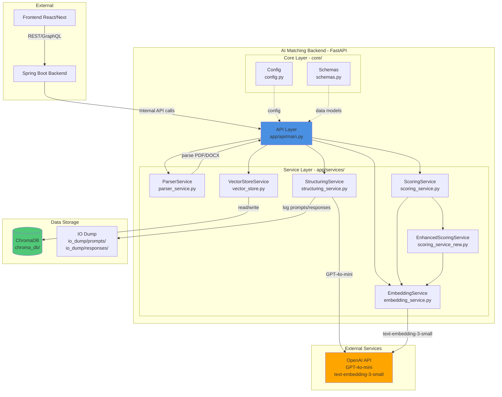

**API Endpoints:**

- `POST /process/cv` - Upload và xử lý CV (PDF/DOCX)
- `POST /process/jd` - Xử lý Job Description (text)
- `GET /match/{cv_id}/{jd_id}` - So khớp CV với JD và trả về điểm số

---

## 2. Luồng Xử lý API - Ba Endpoint Chính

### 2.1 POST /process/cv - Xử lý CV

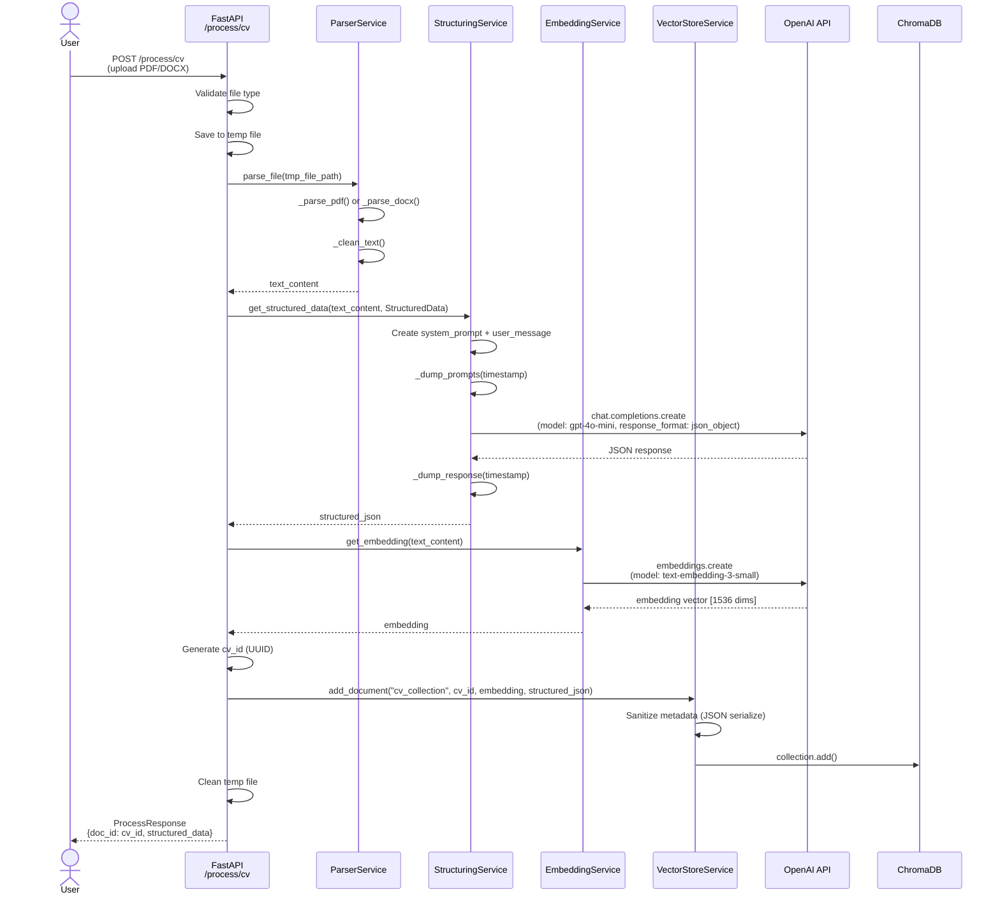

### 2.2 POST /process/jd - Xử lý Job Description

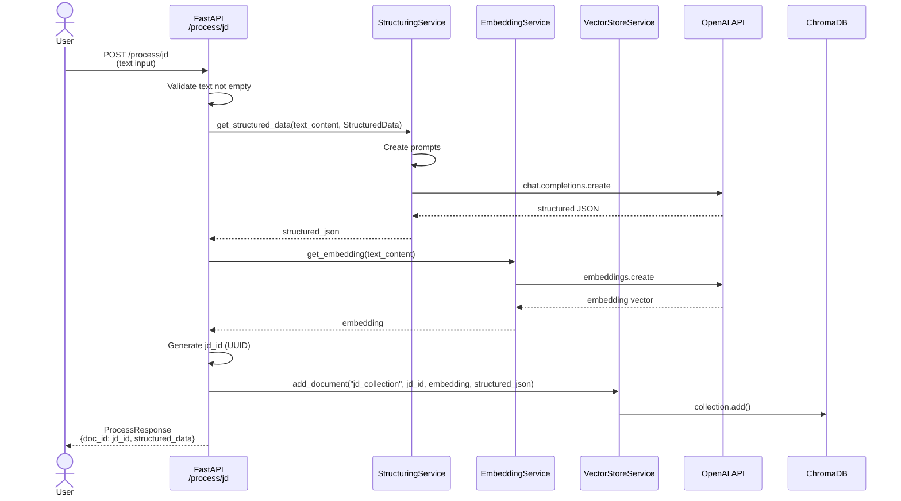

### 2.3 GET /match/{cv_id}/{jd_id} - So khớp CV-JD

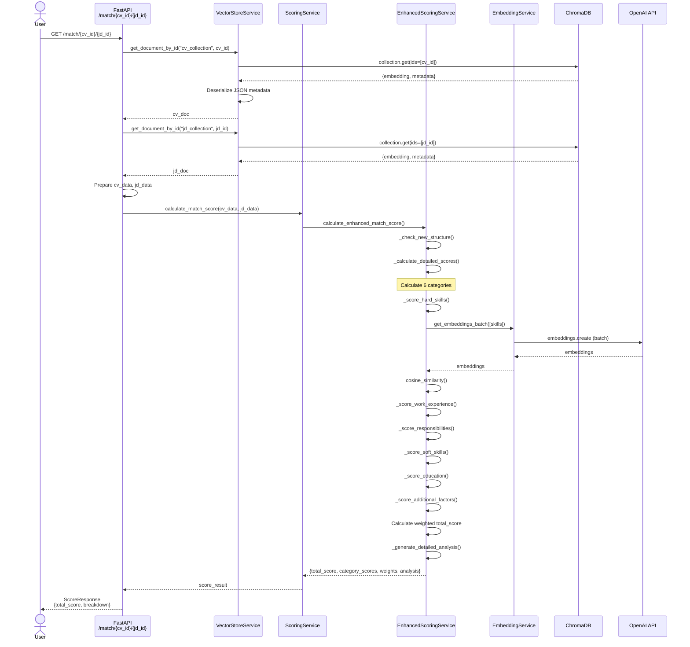

---

## 3. Cấu trúc Data Schema (core/schemas.py)

---

## 4. Hệ thống Chấm điểm 6 Hạng mục (scoring_service_new.py)

```mermaid
graph TB
    subgraph "EnhancedScoringService"
        START[calculate_enhanced_match_score]

        START --> CHECK[_check_new_structure]
        CHECK --> CALC[_calculate_detailed_scores]

        subgraph "6 Categories with Weights"
            CALC --> HS[_score_hard_skills<br/>Weight: 30%]
            CALC --> WE[_score_work_experience<br/>Weight: 25%]
            CALC --> RS[_score_responsibilities<br/>Weight: 15%]
            CALC --> SS[_score_soft_skills<br/>Weight: 10%]
            CALC --> ED[_score_education<br/>Weight: 5%]
            CALC --> AF[_score_additional_factors<br/>Weight: 15%]
        end

        HS --> TOTAL[Calculate total_score]
        WE --> TOTAL
        RS --> TOTAL
        SS --> TOTAL
        ED --> TOTAL
        AF --> TOTAL

        TOTAL --> ANALYSIS[_generate_detailed_analysis]
        ANALYSIS --> RESULT[Return Result]
    end

    subgraph "Scoring Logic Details"
        HS --> HS1[Group skills by category<br/>programming, frameworks, tools, certs]
        HS1 --> HS2[Apply internal weights<br/>2.0, 1.5, 1.0, 1.2, 1.3]
        HS2 --> HS3[Batch embeddings]
        HS3 --> HS4[Cosine similarity matrix]
        HS4 --> HS5[Max similarity per JD skill]
        HS5 --> HS6[Weighted average]

        WE --> WE1[Job title match: 40%]
        WE --> WE2[Industry match: 30%]
        WE --> WE3[Years of experience: 30%<br/>Proportional if less]

        RS --> RS1[Key responsibilities: 60%]
        RS --> RS2[Achievements bonus: 20%]
        RS --> RS3[Project types: 20%]

        SS --> SS1[Communication/Teamwork]
        SS --> SS2[Leadership/Management]
        SS --> SS3[Problem Solving]
        SS --> SS4[Adaptability]
        SS --> SS5[Fallback 0.5 if CV empty but JD requires]

        ED --> ED1[Degrees: 50%]
        ED --> ED2[Majors: 30%]
        ED --> ED3[Additional courses bonus: 20%]

        AF --> AF1[Languages: 40%]
        AF --> AF2[Availability: 30%]
        AF --> AF3[Relocation willingness: 30%]
    end

    style HS fill:#FF6B6B
    style WE fill:#4ECDC4
    style RS fill:#45B7D1
    style SS fill:#96CEB4
    style ED fill:#FFEAA7
    style AF fill:#DFE6E9
    style TOTAL fill:#6C5CE7
```

---

## 5. Chi tiết Logic Chấm điểm Hard Skills

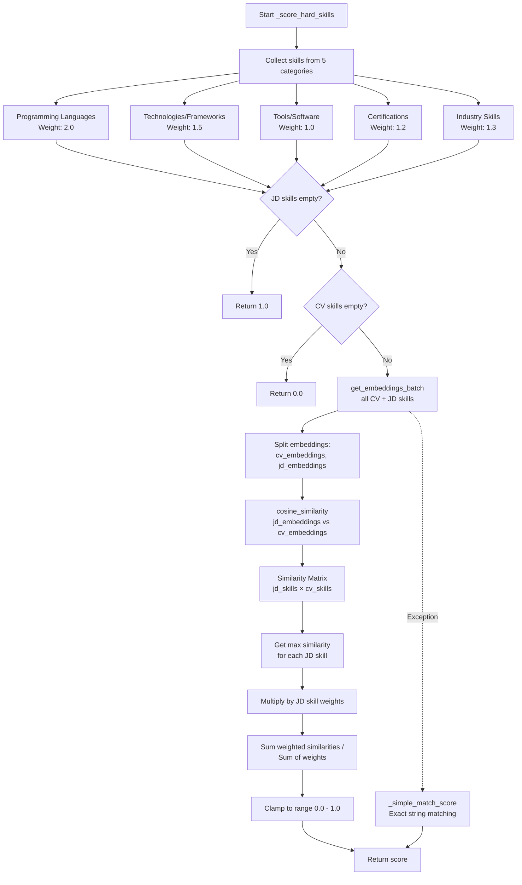

---

## 6. Service Dependencies

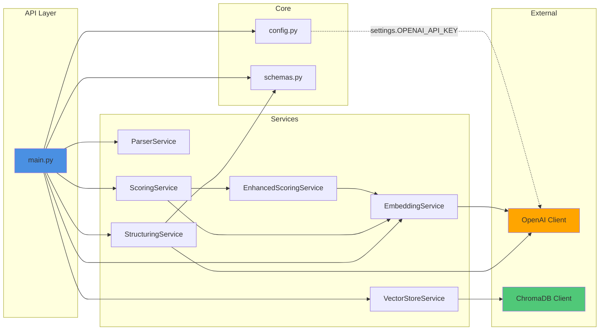

---

## 7. Data Flow - Từ File Upload đến Matching Result

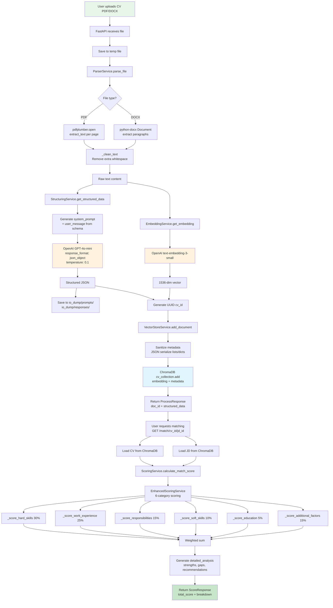

---

## 8. ChromaDB Storage Structure

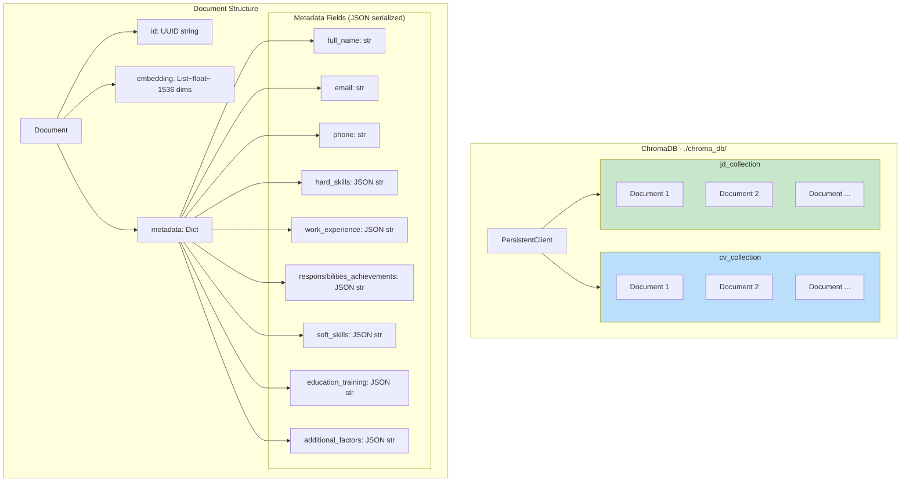

---

## 9. IO Dump Structure - Audit Trail

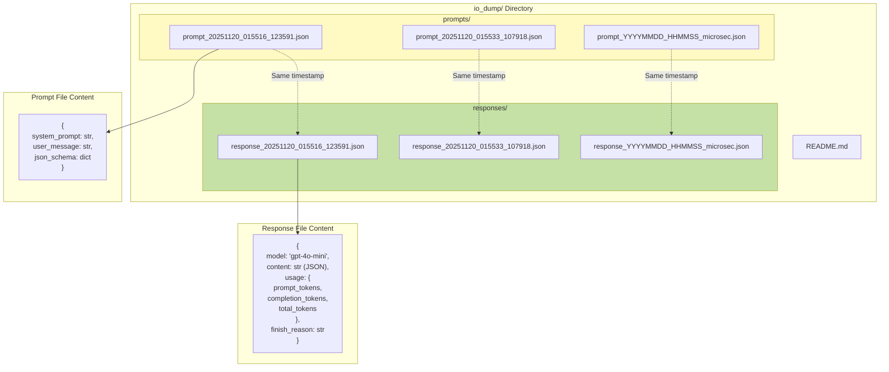

---

## 10. Error Handling Flow

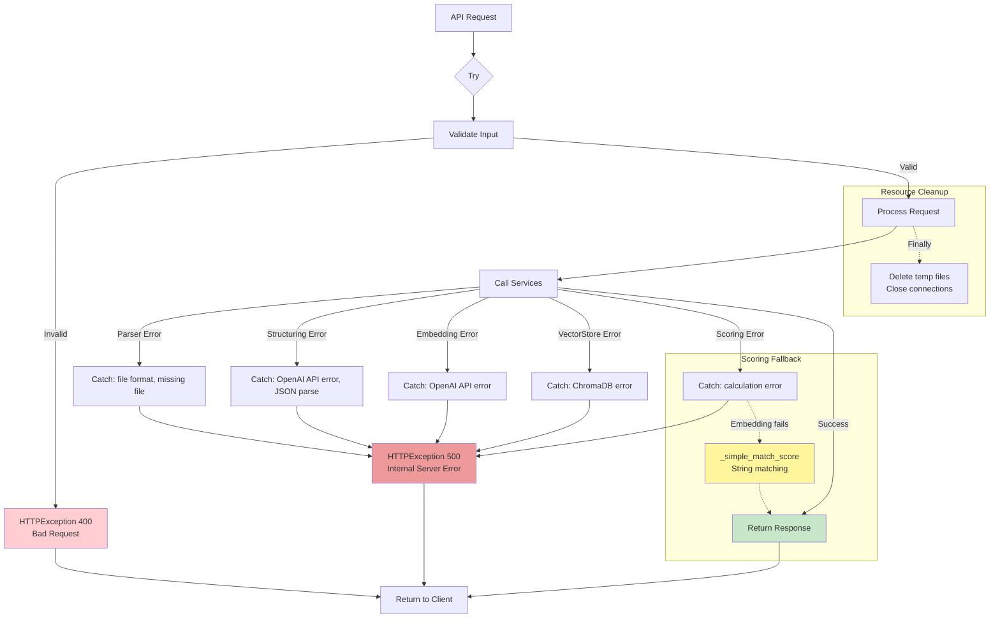

---

## 11. Matching Score Calculation - Detailed Formula

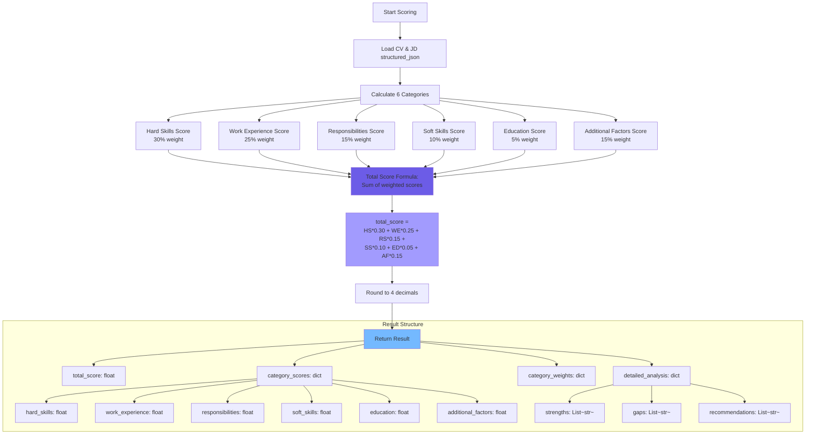

---

## Ghi chú

- Tất cả sơ đồ được vẽ dựa trên code thực tế trong folder `d:\Python Projects\GP`
- Các file tham chiếu:
  - `app/api/main.py` - API endpoints
  - `app/services/*.py` - Service implementations
  - `core/schemas.py` - Data models
  - `core/config.py` - Configuration
- Không có thông tin bịa đặt, tất cả đều dựa trên implementation hiện tại
- Trọng số chấm điểm: Hard Skills 30%, Work Experience 25%, Responsibilities 15%, Soft Skills 10%, Education 5%, Additional Factors 15%
