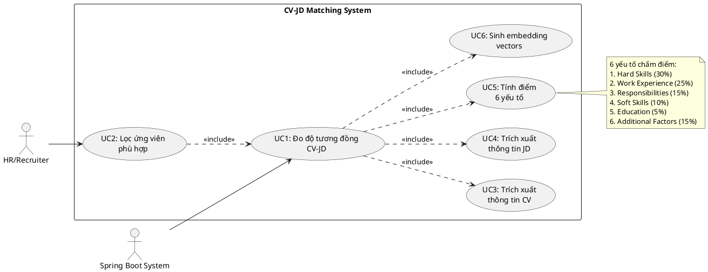
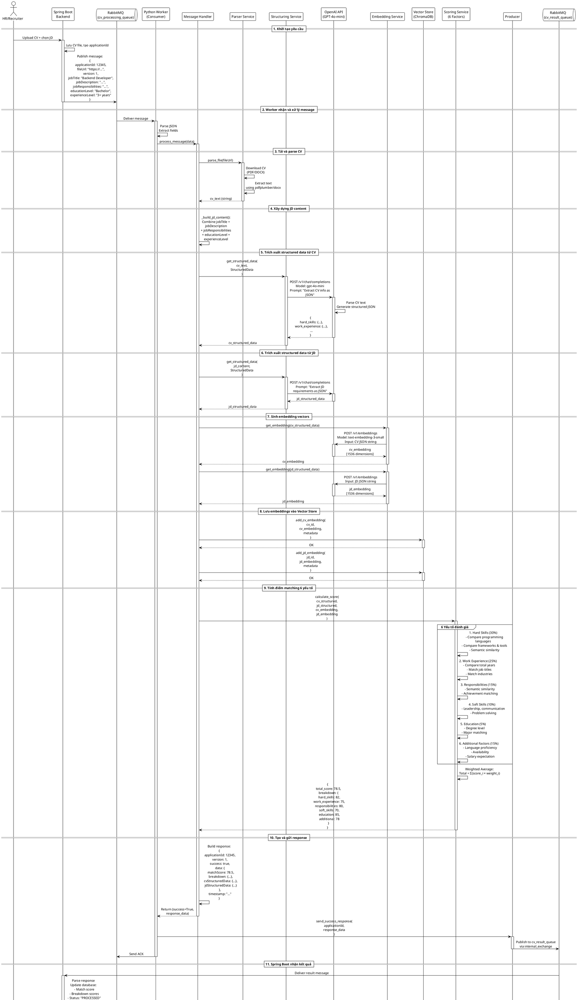
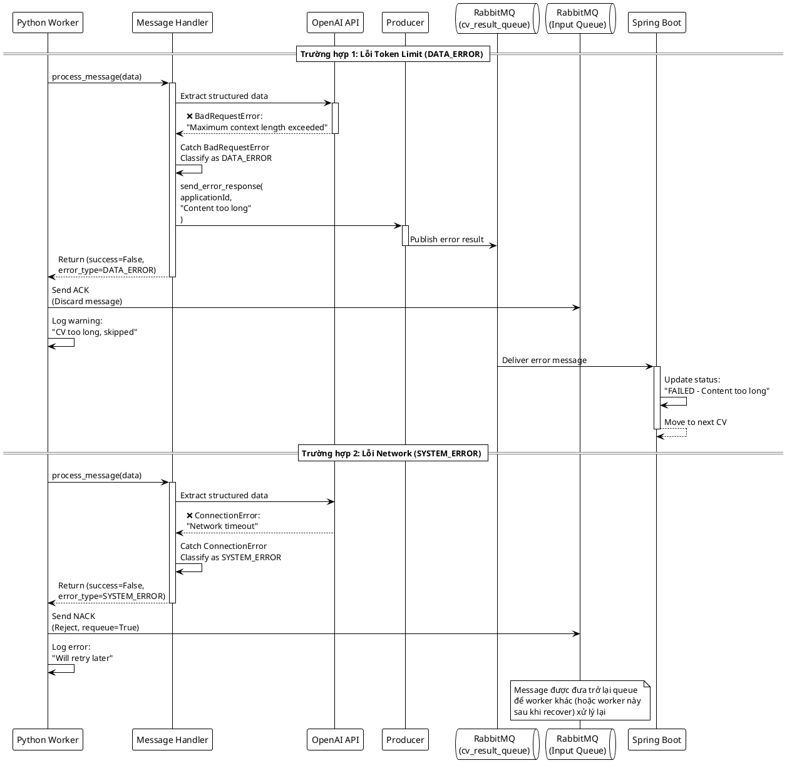

# Tài liệu Phân tích và Thiết kế Hệ thống

## Chức năng Đo Độ Tương Đồng CV-JD

---

## 1. PHA PHÂN TÍCH

### 1.1. Biểu đồ Use Case

```
┌─────────────────────────────────────────────────────────────────┐
│                    Hệ thống CV-JD Matching                       │
│                                                                   │
│                                                                   │
│         ┌─────────────────────────────────────┐                 │
│         │  Đo độ tương đồng CV-JD             │                 │
│         │                                      │                 │
│         │  • Trích xuất thông tin CV          │                 │
│         │  • Trích xuất thông tin JD          │◄─────┐          │
│         │  • Sinh embedding vectors           │      │          │
│         │  • Tính điểm 6 yếu tố               │      │          │
│         │  • Tạo báo cáo chi tiết             │      │          │
│         └─────────────────────────────────────┘      │          │
│                       ▲                               │          │
│                       │                               │          │
│                       │ <<include>>                   │          │
│                       │                               │          │
│         ┌─────────────┴─────────────┐                │          │
│         │ Lọc ứng viên phù hợp       │                │          │
│         │                             │                │          │
│         │  • Nhận danh sách CV        │                │          │
│         │  • So sánh từng CV với JD   │────────────────┘          │
│         │  • Sắp xếp theo điểm số     │                           │
│         │  • Trả về top ứng viên      │                           │
│         └─────────────┬───────────────┘                           │
│                       ▲                                           │
│                       │                                           │
│                       │                                           │
└───────────────────────┼───────────────────────────────────────────┘
                        │
                        │
                   ┌────┴─────┐
                   │          │
                   │   HR /   │
                   │ Recruiter│
                   │          │
                   └──────────┘
```

**Sơ đồ PlantUML:**



---

### 1.2. Kịch bản Use Case Chi tiết

#### **Use Case UC1: Đo độ tương đồng giữa CV và JD**

| **Thuộc tính**     | **Mô tả**                                                                                                                                                                                                                                                                                                                                                                                                                                            |
| ------------------ | ---------------------------------------------------------------------------------------------------------------------------------------------------------------------------------------------------------------------------------------------------------------------------------------------------------------------------------------------------------------------------------------------------------------------------------------------------- |
| **Tên Use Case**   | Đo độ tương đồng giữa CV và JD (CV-JD Matching Score Calculation)                                                                                                                                                                                                                                                                                                                                                                                    |
| **ID**             | UC1                                                                                                                                                                                                                                                                                                                                                                                                                                                  |
| **Mô tả ngắn**     | Hệ thống nhận thông tin CV và JD từ Spring Boot qua RabbitMQ, thực hiện trích xuất thông tin có cấu trúc, tính toán độ tương đồng dựa trên 6 yếu tố đánh giá, và trả về kết quả chi tiết bao gồm điểm số tổng thể và phân tích từng tiêu chí.                                                                                                                                                                                                        |
| **Tác nhân**       | **Chính:** Spring Boot Backend System<br>**Phụ:** OpenAI GPT-4o-mini (AI Service), ChromaDB (Vector Store)                                                                                                                                                                                                                                                                                                                                           |
| **Tiền điều kiện** | 1. Hệ thống Python Worker đang chạy và kết nối thành công với RabbitMQ<br>2. Kết nối với OpenAI API khả dụng<br>3. ChromaDB vector store đã được khởi tạo<br>4. Message chứa thông tin CV và JD đã được đưa vào queue `cv_processing_queue`<br>5. CV file (PDF/DOCX) có thể tải xuống từ `fileUrl`                                                                                                                                                   |
| **Hậu điều kiện**  | **Thành công:**<br>1. Dữ liệu CV và JD đã được trích xuất thành công<br>2. Embedding vectors đã được sinh và lưu vào ChromaDB<br>3. Điểm số 6 yếu tố đã được tính toán<br>4. Kết quả đã được gửi về Spring Boot qua `cv_result_queue`<br>5. Message đã được ACK (xác nhận xử lý)<br><br>**Thất bại:**<br>1. Lỗi được log và thông báo cho Spring Boot<br>2. Message bị NACK nếu là lỗi hệ thống (để retry), hoặc ACK nếu là lỗi dữ liệu (để discard) |

---

#### **Luồng sự kiện chính (Main Flow)**

| **Bước** | **Tác nhân**    | **Hành động**                    | **Mô tả chi tiết**                                                                                                                                                                                                                                                         |
| -------- | --------------- | -------------------------------- | -------------------------------------------------------------------------------------------------------------------------------------------------------------------------------------------------------------------------------------------------------------------------- |
| **1**    | Spring Boot     | Gửi message đến RabbitMQ         | Đưa message chứa `applicationId`, `fileUrl`, `version`, `jobTitle`, `jobDescription`, `jobResponsibilities`, `educationLevel`, `experienceLevel` vào queue `cv_processing_queue` với routing key `cv_upload_key`                                                           |
| **2**    | Python Worker   | Nhận message từ RabbitMQ         | Consumer đọc message từ `cv_processing_queue`, parse JSON và extract các trường dữ liệu                                                                                                                                                                                    |
| **3**    | Python Worker   | Validate dữ liệu đầu vào         | Kiểm tra các trường bắt buộc: `applicationId`, `fileUrl`, `jobTitle`. Nếu thiếu → trả về lỗi DATA_ERROR                                                                                                                                                                    |
| **4**    | Python Worker   | Tải và parse CV                  | Gọi `_download_and_parse_cv(fileUrl)` để tải file PDF/DOCX từ URL, lưu vào temp file, parse thành text bằng `ParserService`                                                                                                                                                |
| **5**    | Python Worker   | Xây dựng JD content              | Gọi `_build_jd_content()` để ghép các trường `jobTitle`, `jobDescription`, `jobResponsibilities`, `educationLevel`, `experienceLevel` thành một văn bản JD hoàn chỉnh                                                                                                      |
| **6**    | Python Worker   | Trích xuất structured data từ CV | Gọi `StructuringService.get_structured_data(cv_text, StructuredData)` để AI trích xuất thông tin có cấu trúc từ CV text theo schema `StructuredData`                                                                                                                       |
| **7**    | OpenAI API      | Xử lý CV text                    | GPT-4o-mini phân tích CV text và trả về JSON chứa: `hard_skills`, `work_experience`, `responsibilities_achievements`, `soft_skills`, `education_training`, `additional_factors`                                                                                            |
| **8**    | Python Worker   | Trích xuất structured data từ JD | Gọi `StructuringService.get_structured_data(jd_content, StructuredData)` để AI trích xuất yêu cầu từ JD                                                                                                                                                                    |
| **9**    | OpenAI API      | Xử lý JD content                 | GPT-4o-mini phân tích JD và trả về JSON theo schema tương tự CV                                                                                                                                                                                                            |
| **10**   | Python Worker   | Sinh embedding cho CV            | Gọi `EmbeddingService.get_embedding(cv_structured)` để tạo vector embedding 1536 chiều từ dữ liệu CV có cấu trúc                                                                                                                                                           |
| **11**   | OpenAI API      | Tạo CV embedding                 | Sử dụng model `text-embedding-3-small` để tạo vector representation từ CV                                                                                                                                                                                                  |
| **12**   | Python Worker   | Sinh embedding cho JD            | Gọi `EmbeddingService.get_embedding(jd_structured)` để tạo vector embedding cho JD                                                                                                                                                                                         |
| **13**   | OpenAI API      | Tạo JD embedding                 | Tạo vector representation từ JD sử dụng cùng model                                                                                                                                                                                                                         |
| **14**   | Python Worker   | Lưu embeddings vào vector store  | Gọi `VectorStore.add_cv_embedding()` và `add_jd_embedding()` để lưu vectors vào ChromaDB collection                                                                                                                                                                        |
| **15**   | ChromaDB        | Lưu trữ vectors                  | Lưu CV và JD embeddings với metadata tương ứng                                                                                                                                                                                                                             |
| **16**   | Python Worker   | Tính điểm matching 6 yếu tố      | Gọi `EnhancedScoringService.calculate_score()` với CV và JD structured data để tính toán:<br>• Hard Skills (30%)<br>• Work Experience (25%)<br>• Responsibilities & Achievements (15%)<br>• Soft Skills (10%)<br>• Education & Training (5%)<br>• Additional Factors (15%) |
| **17**   | Scoring Service | Tính toán chi tiết               | Sử dụng cosine similarity giữa embeddings và semantic matching để tính điểm từng yếu tố, sau đó weighted average để ra tổng điểm                                                                                                                                           |
| **18**   | Python Worker   | Chuẩn bị response data           | Tạo JSON response chứa:<br>• `applicationId`<br>• `version`<br>• `matchScore` (0-100)<br>• `breakdown` (6 scores + weights)<br>• `cvStructuredData`<br>• `jdStructuredData`                                                                                                |
| **19**   | Python Worker   | Gửi kết quả về Spring Boot       | Publish message đến `cv_result_queue` với routing key `cv_result_key` qua exchange `internal_exchange`                                                                                                                                                                     |
| **20**   | RabbitMQ        | Chuyển message đến Spring Boot   | Routing message từ exchange đến queue kết quả                                                                                                                                                                                                                              |
| **21**   | Python Worker   | Xác nhận xử lý thành công        | Gửi ACK cho message gốc, đánh dấu đã xử lý xong                                                                                                                                                                                                                            |
| **22**   | Spring Boot     | Nhận kết quả                     | Consume message từ `cv_result_queue`, parse JSON và lưu vào database                                                                                                                                                                                                       |

---

#### **Luồng sự kiện thay thế (Alternative Flows)**

**A1: Lỗi tải CV file (Bước 4)**

- **Điều kiện:** URL không hợp lệ hoặc file không tồn tại
- **Xử lý:**
  1. Log lỗi với `applicationId` và `fileUrl`
  2. Tạo error response: `error: "Failed to download CV file"`
  3. Gửi error response về Spring Boot
  4. ACK message (DATA_ERROR - không retry)
  5. Kết thúc

**A2: Lỗi parse CV file (Bước 4)**

- **Điều kiện:** File bị corrupt hoặc format không hỗ trợ
- **Xử lý:**
  1. Log lỗi với chi tiết exception
  2. Tạo error response: `error: "Failed to parse CV content"`
  3. Gửi error response về Spring Boot
  4. ACK message (DATA_ERROR)
  5. Kết thúc

**A3: Lỗi token limit từ OpenAI (Bước 6, 8, 10, 12)**

- **Điều kiện:** CV hoặc JD quá dài, vượt quá 8192 tokens
- **Xử lý:**
  1. Catch `openai.BadRequestError` với message "maximum context length"
  2. Log warning với `applicationId`
  3. Tạo error response: `error: "Content too long for processing"`
  4. Gửi error response về Spring Boot
  5. ACK message (DATA_ERROR - không retry vì nội dung luôn quá dài)
  6. Kết thúc

**A4: Lỗi kết nối OpenAI API (Bước 6-13)**

- **Điều kiện:** Network error, API timeout, rate limit
- **Xử lý:**
  1. Log exception với stack trace
  2. NACK message (SYSTEM_ERROR)
  3. Message được re-queue để retry sau
  4. Kết thúc (chờ retry)

**A5: Lỗi ChromaDB connection (Bước 14-15)**

- **Điều kiện:** Vector store không khả dụng
- **Xử lý:**
  1. Log critical error
  2. NACK message (SYSTEM_ERROR)
  3. Re-queue message
  4. Kết thúc (chờ retry)

**A6: Lỗi gửi kết quả về Spring Boot (Bước 19)**

- **Điều kiện:** RabbitMQ connection lost
- **Xử lý:**
  1. Log error
  2. Thử reconnect RabbitMQ (3 lần)
  3. Nếu thành công: gửi lại kết quả → ACK
  4. Nếu thất bại: NACK message → retry toàn bộ flow

---

#### **Luồng sự kiện ngoại lệ (Exception Flows)**

**E1: Message format không hợp lệ**

- **Điều kiện:** JSON không parse được hoặc thiếu trường bắt buộc
- **Xử lý:**
  1. Log error với raw message content
  2. Gửi error response về Spring Boot (nếu parse được `applicationId`)
  3. ACK message (DATA_ERROR)
  4. Không retry

**E2: Worker shutdown trong quá trình xử lý**

- **Điều kiện:** SIGTERM/SIGINT received
- **Xử lý:**
  1. NACK message hiện tại
  2. Đóng kết nối RabbitMQ gracefully
  3. Message sẽ được worker khác xử lý

---

### 1.3. Yêu cầu phi chức năng

| **Yêu cầu**           | **Chi tiết**                                                                                                                  |
| --------------------- | ----------------------------------------------------------------------------------------------------------------------------- |
| **Hiệu năng**         | • Xử lý 1 CV trong vòng 10-30 giây<br>• Hỗ trợ xử lý đồng thời tối thiểu 10 messages (prefetch_count=10)                      |
| **Độ tin cậy**        | • Retry tự động cho SYSTEM_ERROR<br>• Dead Letter Queue cho messages failed quá 3 lần<br>• ACK đảm bảo at-least-once delivery |
| **Khả năng mở rộng**  | • Có thể scale horizontal bằng cách thêm worker instances<br>• Stateless design cho dễ dàng scale                             |
| **Bảo mật**           | • API key được quản lý qua environment variables<br>• TLS cho RabbitMQ connection<br>• Không log sensitive data (CV content)  |
| **Khả năng giám sát** | • Log structured với timestamp, applicationId, execution time<br>• Error tracking với full stack trace                        |

---

## 2. PHA THIẾT KẾ

### 2.1. Lược đồ tuần tự (Sequence Diagram)

**Mô tả:** Biểu đồ tuần tự chi tiết cho chức năng đo độ tương đồng CV-JD phục vụ lọc ứng viên.



---

### 2.2. Luồng xử lý lỗi (Error Flow Sequence)



---

### 2.3. Kiến trúc thành phần (Component Architecture)

```
┌─────────────────────────────────────────────────────────────────────┐
│                         Spring Boot Backend                          │
│  ┌────────────────┐         ┌─────────────────┐                    │
│  │ CV Controller  │────────▶│  Job Service    │                    │
│  └────────────────┘         └─────────────────┘                    │
│         │                            │                               │
│         ▼                            ▼                               │
│  ┌──────────────────────────────────────────┐                       │
│  │      RabbitMQ Producer                   │                       │
│  │  - Exchange: internal_exchange           │                       │
│  │  - Routing Key: cv_upload_key            │                       │
│  └──────────────────────────────────────────┘                       │
└────────────────────────────┬────────────────────────────────────────┘
                             │
                             │ AMQP over TLS
                             ▼
┌─────────────────────────────────────────────────────────────────────┐
│                       CloudAMQP (RabbitMQ)                          │
│                                                                      │
│  ┌────────────────────────────────────────────────────────────┐   │
│  │  Exchange: internal_exchange (Direct)                       │   │
│  │  ┌──────────────────────┐    ┌─────────────────────────┐  │   │
│  │  │ cv_processing_queue  │    │   cv_result_queue       │  │   │
│  │  │ (Input from Spring)  │    │   (Output to Spring)    │  │   │
│  │  └──────────────────────┘    └─────────────────────────┘  │   │
│  └────────────────────────────────────────────────────────────┘   │
└─────────────────────────────────────────────────────────────────────┘
                             │
                             │ Pika Client
                             ▼
┌─────────────────────────────────────────────────────────────────────┐
│                    Python AI Worker                                  │
│                                                                      │
│  ┌──────────────────────────────────────────────────────────────┐  │
│  │  RabbitMQ Layer                                               │  │
│  │  ┌─────────────┐  ┌──────────────┐  ┌─────────────┐        │  │
│  │  │ Connection  │  │  Consumer    │  │  Producer   │        │  │
│  │  │  Manager    │  │  (Prefetch)  │  │             │        │  │
│  │  └─────────────┘  └──────────────┘  └─────────────┘        │  │
│  └──────────────────────────────────────────────────────────────┘  │
│                                                                      │
│  ┌──────────────────────────────────────────────────────────────┐  │
│  │  Business Logic Layer                                         │  │
│  │  ┌──────────────────────────────────────────────────────┐   │  │
│  │  │         Message Handler (Orchestrator)                │   │  │
│  │  │  - Workflow coordination                              │   │  │
│  │  │  - Error handling & retry logic                       │   │  │
│  │  │  - Logging & monitoring                               │   │  │
│  │  └──────────────────────────────────────────────────────┘   │  │
│  └──────────────────────────────────────────────────────────────┘  │
│                                                                      │
│  ┌──────────────────────────────────────────────────────────────┐  │
│  │  Service Layer                                                │  │
│  │  ┌──────────────┐  ┌──────────────┐  ┌──────────────┐      │  │
│  │  │   Parser     │  │ Structuring  │  │  Embedding   │      │  │
│  │  │   Service    │  │   Service    │  │   Service    │      │  │
│  │  │ (PDF/DOCX)   │  │ (AI Extract) │  │  (Vectors)   │      │  │
│  │  └──────────────┘  └──────────────┘  └──────────────┘      │  │
│  │  ┌──────────────┐  ┌──────────────┐                         │  │
│  │  │   Scoring    │  │ Vector Store │                         │  │
│  │  │   Service    │  │   Service    │                         │  │
│  │  │ (6 Factors)  │  │  (ChromaDB)  │                         │  │
│  │  └──────────────┘  └──────────────┘                         │  │
│  └──────────────────────────────────────────────────────────────┘  │
│                                                                      │
│  ┌──────────────────────────────────────────────────────────────┐  │
│  │  External Dependencies                                        │  │
│  │  ┌─────────────────────────────┐  ┌────────────────────────┐│  │
│  │  │      OpenAI API             │  │      ChromaDB          ││  │
│  │  │  - GPT-4o-mini (Extract)    │  │  - Persistent storage  ││  │
│  │  │  - text-embedding-3-small   │  │  - Cosine similarity   ││  │
│  │  └─────────────────────────────┘  └────────────────────────┘│  │
│  └──────────────────────────────────────────────────────────────┘  │
└─────────────────────────────────────────────────────────────────────┘
```

---

### 2.4. Mô hình dữ liệu (Data Model)

#### **Input Message Schema**

```json
{
  "applicationId": "number (Long) - ID đơn ứng tuyển",
  "fileUrl": "string - URL để download CV (PDF/DOCX)",
  "version": "number (Integer) - Version của message schema",
  "jobTitle": "string - Tên vị trí tuyển dụng",
  "jobDescription": "string - Mô tả công việc",
  "jobResponsibilities": "string - Trách nhiệm công việc",
  "educationLevel": "string - Trình độ học vấn yêu cầu",
  "experienceLevel": "string - Mức độ kinh nghiệm yêu cầu"
}
```

#### **StructuredData Schema** (CV và JD)

```json
{
  "hard_skills": {
    "programming_languages": ["string"],
    "technologies_frameworks": ["string"],
    "tools_software": ["string"],
    "certifications": ["string"],
    "industry_specific_skills": ["string"]
  },
  "work_experience": {
    "total_years": "number",
    "job_titles": ["string"],
    "industries": ["string"],
    "companies": ["string"],
    "company_sizes": ["string"]
  },
  "responsibilities_achievements": {
    "key_responsibilities": ["string"],
    "achievements": ["string"],
    "project_types": ["string"]
  },
  "soft_skills": {
    "communication_teamwork": ["string"],
    "leadership_management": ["string"],
    "problem_solving": ["string"],
    "adaptability": ["string"]
  },
  "education_training": {
    "degrees": ["string"],
    "majors": ["string"],
    "universities": ["string"],
    "additional_courses": ["string"]
  },
  "additional_factors": {
    "languages": ["string"],
    "availability": "string",
    "relocation_willingness": "boolean",
    "travel_willingness": "boolean",
    "expected_salary": "string"
  }
}
```

#### **Output Message Schema**

```json
{
  "applicationId": "number - Same as input",
  "version": "number - Same as input",
  "success": "boolean - Processing status",
  "data": {
    "matchScore": "number (0-100) - Overall matching score",
    "breakdown": {
      "hard_skills_score": "number (0-100)",
      "hard_skills_weight": "number (0-1) - Fixed at 0.3",
      "work_experience_score": "number (0-100)",
      "work_experience_weight": "number - Fixed at 0.25",
      "responsibilities_achievements_score": "number (0-100)",
      "responsibilities_achievements_weight": "number - Fixed at 0.15",
      "soft_skills_score": "number (0-100)",
      "soft_skills_weight": "number - Fixed at 0.1",
      "education_training_score": "number (0-100)",
      "education_training_weight": "number - Fixed at 0.05",
      "additional_factors_score": "number (0-100)",
      "additional_factors_weight": "number - Fixed at 0.15"
    },
    "cvStructuredData": "object - StructuredData",
    "jdStructuredData": "object - StructuredData"
  },
  "error": "string | null - Error message if failed",
  "timestamp": "string (ISO 8601) - Processing timestamp"
}
```

---

### 2.5. Công thức tính điểm (Scoring Formula)

```
Total Match Score = Σ(Factor_Score_i × Weight_i)

Where:
  Factor_Score_i ∈ [0, 100]  (normalized score for each factor)

Weights:
  Weight_hard_skills = 0.30 (30%)
  Weight_work_experience = 0.25 (25%)
  Weight_responsibilities = 0.15 (15%)
  Weight_soft_skills = 0.10 (10%)
  Weight_education = 0.05 (5%)
  Weight_additional = 0.15 (15%)

  Σ Weights = 1.0 (100%)

Detailed Calculation:

1. Hard Skills Score (30%):
   - Programming languages match: 40% of factor
   - Frameworks/tools match: 40% of factor
   - Certifications match: 20% of factor
   - Using Jaccard similarity for set matching

2. Work Experience Score (25%):
   - Years of experience fit: 40% of factor
   - Job title relevance: 30% of factor
   - Industry match: 30% of factor

3. Responsibilities Score (15%):
   - Semantic similarity of responsibilities: 60% of factor
   - Achievement relevance: 40% of factor
   - Using cosine similarity of embeddings

4. Soft Skills Score (10%):
   - Leadership skills: 40% of factor
   - Communication skills: 35% of factor
   - Problem-solving: 25% of factor

5. Education Score (5%):
   - Degree level match: 50% of factor
   - Major relevance: 50% of factor

6. Additional Factors Score (15%):
   - Language proficiency: 40% of factor
   - Availability alignment: 30% of factor
   - Salary expectation fit: 30% of factor
```

---

### 2.6. Xử lý đồng thời và Scale (Concurrency & Scalability)

```
┌─────────────────────────────────────────────────────────────┐
│                    Horizontal Scaling                        │
│                                                               │
│  ┌──────────────┐  ┌──────────────┐  ┌──────────────┐      │
│  │  Worker #1   │  │  Worker #2   │  │  Worker #N   │      │
│  │ (Prefetch:10)│  │ (Prefetch:10)│  │ (Prefetch:10)│      │
│  └───────┬──────┘  └───────┬──────┘  └───────┬──────┘      │
│          │                  │                  │              │
│          └──────────────────┼──────────────────┘              │
│                             ▼                                 │
│              ┌───────────────────────────┐                   │
│              │   cv_processing_queue     │                   │
│              │   (Round-robin delivery)  │                   │
│              └───────────────────────────┘                   │
│                                                               │
│  Characteristics:                                            │
│  • Stateless workers - can be scaled easily                 │
│  • Each worker maintains own ChromaDB connection            │
│  • Shared OpenAI API quota (rate limit awareness)           │
│  • Independent ACK/NACK per worker                           │
│  • No shared state between workers                           │
│                                                               │
│  Throughput:                                                 │
│  • Single worker: ~6-10 CVs/minute (10-30s per CV)          │
│  • 5 workers: ~30-50 CVs/minute                              │
│  • 10 workers: ~60-100 CVs/minute                            │
│                                                               │
└─────────────────────────────────────────────────────────────┘
```

---

## 3. CÔNG NGHỆ SỬ DỤNG

| **Component**          | **Technology**         | **Version** | **Purpose**                  |
| ---------------------- | ---------------------- | ----------- | ---------------------------- |
| **Backend**            | Spring Boot            | 3.x         | Main application server      |
| **AI Worker**          | Python                 | 3.11+       | Async message processing     |
| **Message Queue**      | RabbitMQ (CloudAMQP)   | 3.x         | Message broker               |
| **Python MQ Client**   | Pika                   | 1.3.2       | RabbitMQ Python client       |
| **AI Model (Extract)** | GPT-4o-mini            | Latest      | Structured data extraction   |
| **AI Model (Embed)**   | text-embedding-3-small | Latest      | Vector embeddings (1536-dim) |
| **Vector Database**    | ChromaDB               | 0.4.x       | Similarity search            |
| **PDF Parser**         | pdfplumber             | 0.10.x      | Extract text from PDF        |
| **DOCX Parser**        | python-docx            | 1.1.x       | Extract text from Word       |
| **HTTP Client**        | requests               | 2.31.0      | Download CV files            |
| **Validation**         | Pydantic               | 2.x         | Data validation & schemas    |
| **Logging**            | Python logging         | Built-in    | Structured logging           |

---

## 4. KẾT LUẬN

Tài liệu này mô tả chi tiết:

1. **Pha phân tích:**

   - Use case diagram cho hệ thống CV-JD matching
   - Kịch bản chi tiết với 22 bước xử lý chính
   - 6 luồng xử lý lỗi (alternative flows)
   - 2 luồng ngoại lệ (exception flows)

2. **Pha thiết kế:**
   - Sequence diagram đầy đủ cho main flow
   - Error handling sequence diagram
   - Component architecture
   - Data model schemas
   - Scoring formula chi tiết
   - Scalability design

Hệ thống được thiết kế với:

- ✅ **High reliability** (ACK/NACK, retry, DLQ)
- ✅ **Horizontal scalability** (stateless workers)
- ✅ **Clear error handling** (DATA_ERROR vs SYSTEM_ERROR)
- ✅ **Comprehensive scoring** (6 weighted factors)
- ✅ **Production-ready** (logging, monitoring, graceful shutdown)

---

**Tác giả:** AI System Design Team  
**Ngày tạo:** December 16, 2025  
**Phiên bản:** 1.0
