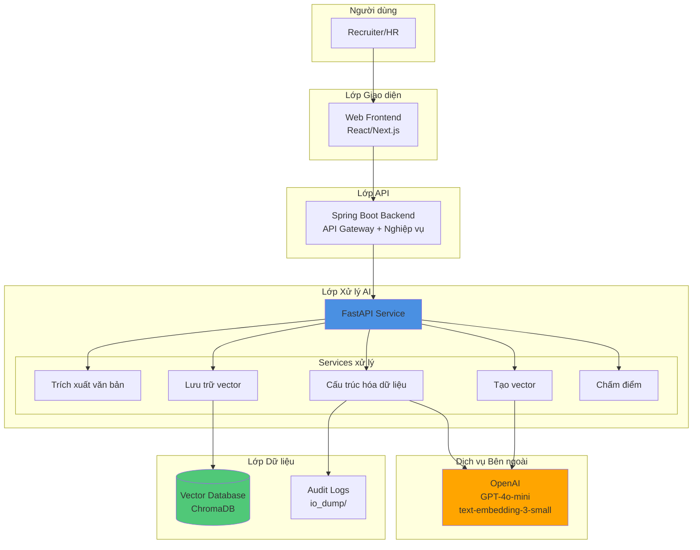
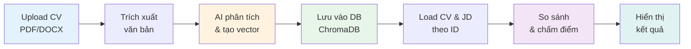
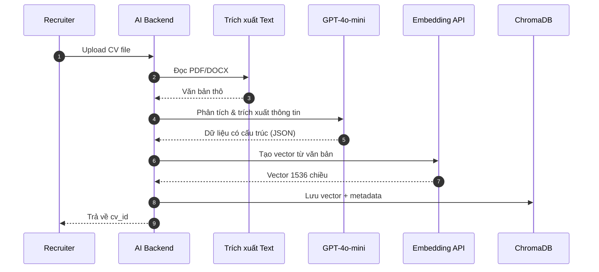
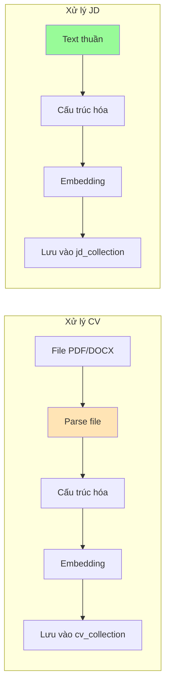
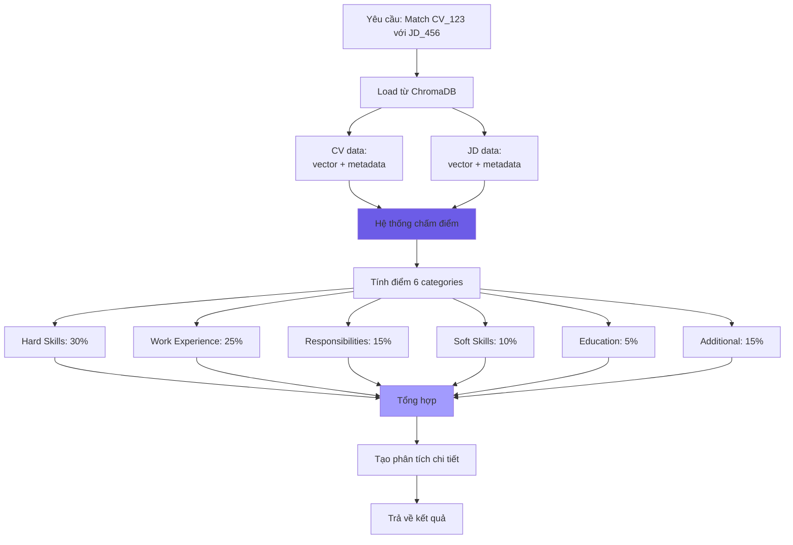
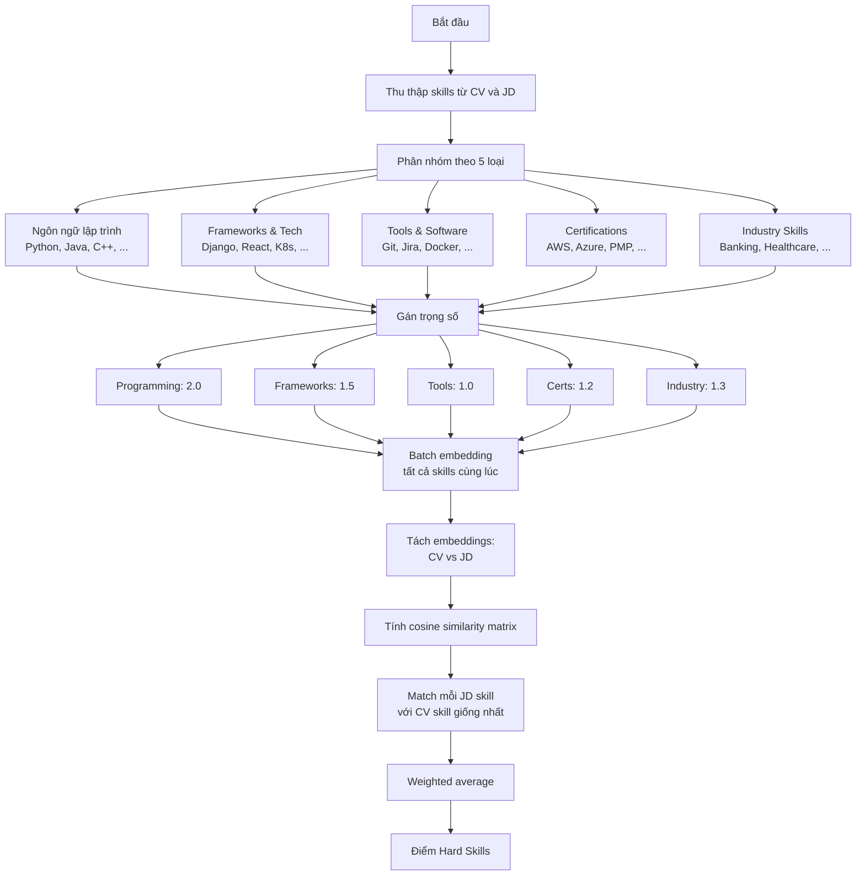
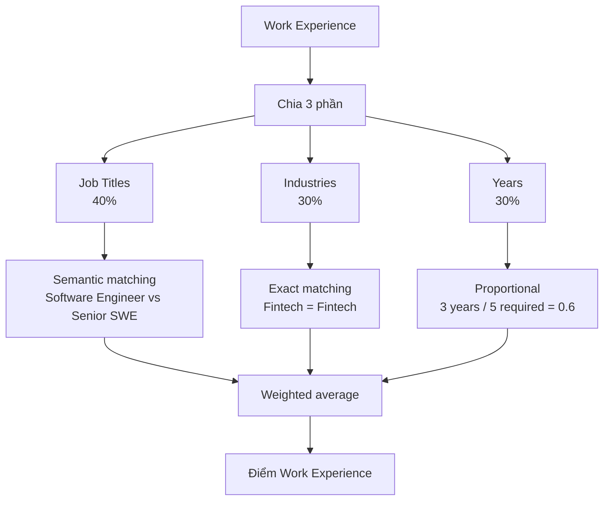
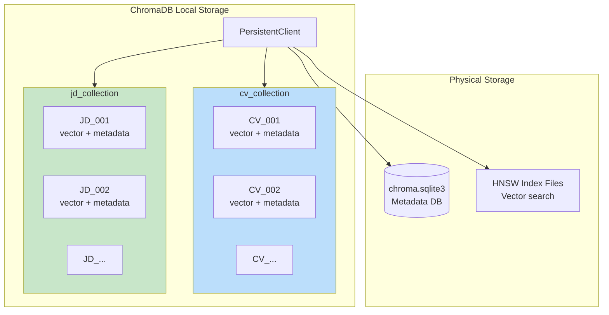

# Tài liệu Kiến trúc Hệ thống So khớp CV-JD

> Mô tả chi tiết cách hệ thống xử lý, phân tích và so khớp CV với Job Description sử dụng AI

---

## Mục lục

1. [Tổng quan Kiến trúc](#1-tổng-quan-kiến-trúc)
2. [Quy trình Xử lý CV](#2-quy-trình-xử-lý-cv)
3. [Quy trình Xử lý JD](#3-quy-trình-xử-lý-jd)
4. [Hệ thống So khớp và Chấm điểm](#4-hệ-thống-so-khớp-và-chấm-điểm)
5. [Chi tiết 6 Tiêu chí Đánh giá](#5-chi-tiết-6-tiêu-chí-đánh-giá)
6. [Lưu trữ và Quản lý Dữ liệu](#6-lưu-trữ-và-quản-lý-dữ-liệu)
7. [Giám sát và Audit](#7-giám-sát-và-audit)

---

## 1. Tổng quan Kiến trúc

### 1.1 Kiến trúc Hệ thống



### 1.2 Các Thành phần Chính

| Thành phần      | Vai trò                                               | Công nghệ         |
| --------------- | ----------------------------------------------------- | ----------------- |
| **Frontend**    | Giao diện upload CV/JD, hiển thị kết quả              | React/Next.js     |
| **Spring Boot** | Quản lý authentication, authorization, business logic | Java Spring Boot  |
| **FastAPI**     | Xử lý AI tasks, orchestrate các services              | Python FastAPI    |
| **OpenAI**      | Trích xuất thông tin (GPT-4o-mini), tạo embeddings    | Cloud API         |
| **ChromaDB**    | Lưu trữ vectors và metadata                           | Embedded database |

### 1.3 Luồng Hoạt động Tổng quát



---

## 2. Quy trình Xử lý CV

### 2.1 Tổng quan



### 2.2 Bước 1: Trích xuất Văn bản

**Xử lý file PDF:**

- Mở file bằng thư viện `pdfplumber`
- Đọc từng trang, extract text từ mỗi trang
- Gộp tất cả text các trang thành 1 chuỗi

**Xử lý file DOCX:**

- Mở file bằng thư viện `python-docx`
- Đọc từng paragraph
- Gộp tất cả paragraphs thành 1 chuỗi

**Làm sạch văn bản:**

- Loại bỏ khoảng trắng thừa (nhiều space → 1 space)
- Xóa dòng trống liên tiếp
- Chuẩn hóa line breaks

**Kết quả:** Văn bản thô đã được làm sạch, sẵn sàng cho bước tiếp theo

### 2.3 Bước 2: Cấu trúc hóa với GPT-4o-mini

#### 2.3.1 Tạo Prompt cho AI

**System Prompt được tạo tự động:**

```
Bạn là chuyên gia trích xuất thông tin từ CV và JD với kinh nghiệm tuyển dụng.

Nhiệm vụ: Phân tích văn bản và trích xuất thông tin theo 6 nhóm:
1. Hard Skills (30% quan trọng)
   - Ngôn ngữ lập trình
   - Framework và công nghệ
   - Tools và software
   - Certifications
   - Kỹ năng chuyên ngành

2. Work Experience (25% quan trọng)
   - Tổng số năm kinh nghiệm
   - Job titles
   - Industries/sectors
   - Tên công ty
   - Quy mô công ty

3. Responsibilities & Achievements (15% quan trọng)
   - Nhiệm vụ chính
   - Thành tích đạt được
   - Loại dự án

4. Soft Skills (10% quan trọng)
   - Communication & Teamwork
   - Leadership & Management
   - Problem Solving
   - Adaptability

5. Education & Training (5% quan trọng)
   - Bằng cấp
   - Chuyên ngành
   - Trường đại học
   - Khóa học bổ sung

6. Additional Factors (15% quan trọng)
   - Ngôn ngữ và trình độ
   - Thời gian có thể bắt đầu
   - Sẵn sàng di chuyển/travel

Quy tắc:
- Trả về ONLY valid JSON
- Nếu không tìm thấy thông tin → dùng []  hoặc null
- Với JD: Tập trung vào REQUIREMENTS (required, must have, essential)
- Với CV: Trích xuất TẤT CẢ thông tin liên quan
- Sử dụng tiếng Anh cho dữ liệu trích xuất
```

**User Message:**

```
Please analyze and extract structured information from the following text:

[Văn bản CV đầy đủ ở đây]
```

#### 2.3.2 Gọi OpenAI API

**Cấu hình request:**

- Model: `gpt-4o-mini` (cost-effective, fast, đủ accurate)
- Temperature: `0.1` (thấp để kết quả deterministic, ít random)
- Response format: `json_object` (force model trả về valid JSON)

**Xử lý response:**

- Parse JSON từ response content
- Validate theo Pydantic schema (auto check types, required fields)
- Lưu prompt và response vào `io_dump/` với timestamp

**Ví dụ Output thực tế:**

```json
{
  "full_name": "Nguyễn Văn A",
  "email": "nguyenvana@email.com",
  "phone": "+84 912 345 678",
  "hard_skills": {
    "programming_languages": ["Python", "Java", "JavaScript"],
    "technologies_frameworks": ["Django", "React", "Docker", "Kubernetes"],
    "tools_software": ["Git", "Jira", "VS Code"],
    "certifications": ["AWS Certified Developer"],
    "industry_specific_skills": ["Microservices Architecture", "CI/CD"]
  },
  "work_experience": {
    "total_years": 5.0,
    "job_titles": ["Software Engineer", "Senior Backend Developer"],
    "industries": ["Fintech", "E-commerce"],
    "companies": ["Company A", "Company B"],
    "company_sizes": ["Startup (50 employees)", "Scale-up (200 employees)"]
  },
  "responsibilities_achievements": {
    "key_responsibilities": [
      "Thiết kế và phát triển RESTful APIs",
      "Quản lý team 3 developers",
      "Code review và mentoring"
    ],
    "achievements": [
      "Giảm API response time 40%",
      "Tăng test coverage từ 60% lên 85%"
    ],
    "project_types": ["Web applications", "Microservices", "Mobile backends"]
  },
  "soft_skills": {
    "communication_teamwork": ["Team collaboration", "Agile ceremonies"],
    "leadership_management": ["Mentoring junior devs", "Technical lead"],
    "problem_solving": ["Root cause analysis", "Performance optimization"],
    "adaptability": ["Quick learner", "Cross-functional work"]
  },
  "education_training": {
    "degrees": ["Bachelor of Computer Science"],
    "majors": ["Software Engineering"],
    "universities": ["University of Technology"],
    "additional_courses": ["AWS Training", "Docker & Kubernetes Course"]
  },
  "additional_factors": {
    "languages": ["Vietnamese: Native", "English: Fluent", "Japanese: Basic"],
    "availability": "1 month notice",
    "relocation_willingness": true,
    "travel_willingness": true,
    "expected_salary": "2000 - 2500 USD"
  }
}
```

**Tại sao dùng GPT-4o-mini?**

- Chi phí thấp (~$0.15 per 1M input tokens vs $5 của GPT-4)
- Tốc độ nhanh (~2-3 giây)
- Đủ chính xác cho task trích xuất thông tin có cấu trúc
- Hỗ trợ `response_format=json_object` để đảm bảo valid JSON

### 2.4 Bước 3: Tạo Vector Embedding

**Mục đích:** Chuyển văn bản thành vector số học để máy tính có thể "hiểu" ngữ nghĩa

**Cách thực hiện:**

- Input: Toàn bộ văn bản gốc (KHÔNG phải JSON có cấu trúc)
- Gọi OpenAI `text-embedding-3-small` API
- Nhận về vector 1536 số thực (float)

**Ví dụ (simplified):**

```
Input: "Senior Python Developer with 5 years experience in Django..."
Output: [0.023, -0.041, 0.089, ..., 0.012] (1536 numbers)
```

**Tại sao dùng văn bản gốc chứ không phải JSON?**

- Văn bản tự nhiên giữ nguyên ngữ cảnh, cách diễn đạt
- JSON mất đi "tone" và "flow" của văn bản
- Embedding từ natural text chính xác hơn cho semantic search

**Tại sao dùng text-embedding-3-small?**

- Model mới nhất của OpenAI (released 2024)
- 1536 dimensions (vừa đủ, không quá lớn)
- Cost: $0.02 per 1M tokens
- Performance tốt cho matching tasks

### 2.5 Bước 4: Lưu trữ vào Vector Database

**Thông tin lưu trữ:**

1. **ID duy nhất**: UUID được generate (ví dụ: `a7b3c9d1-4e5f-...`)
2. **Vector embedding**: 1536 số thực
3. **Metadata**: Toàn bộ JSON có cấu trúc từ bước 2

**Vấn đề kỹ thuật:**
ChromaDB chỉ chấp nhận metadata là scalar values (string, number, boolean), không chấp nhận nested objects hoặc arrays.

**Giải pháp:**
Convert tất cả nested structures thành JSON strings:

```python
# Original data
metadata = {
    "hard_skills": {
        "programming_languages": ["Python", "Java"]
    }
}

# Sau khi serialize
metadata = {
    "hard_skills": '{"programming_languages": ["Python", "Java"]}'
}
```

**Khi lấy dữ liệu ra:**

- Tự động detect JSON strings
- Parse ngược về Python objects
- Fallback sang plain string nếu không phải JSON

**Nơi lưu trữ:**

- Collection: `cv_collection` (riêng cho CVs)
- Persist to disk: `./chroma_db/` directory
- Index: HNSW (Hierarchical Navigable Small World) cho fast similarity search

---

## 3. Quy trình Xử lý JD

### 3.1 So sánh với Xử lý CV



### 3.2 Điểm Khác biệt

| Khía cạnh     | CV                        | JD                                     |
| ------------- | ------------------------- | -------------------------------------- |
| **Input**     | File nhị phân (PDF/DOCX)  | Text đã có sẵn                         |
| **Parsing**   | Cần parse để extract text | Bỏ qua bước này                        |
| **Prompt AI** | Focus vào "extract ALL"   | Focus vào "REQUIREMENTS"               |
| **Use case**  | Ứng viên upload 1 lần     | Recruiter tạo template, dùng nhiều lần |
| **Caching**   | Ít tái sử dụng            | Có thể cache (1 JD match nhiều CVs)    |

### 3.3 Tối ưu cho JD

**Khi GPT-4o-mini phân tích JD:**

- Tìm từ khóa: "required", "must have", "essential", "mandatory"
- Priority cho requirements thay vì nice-to-have
- Extract minimum requirements (years, education level)

**Ví dụ JD text:**

```
Position: Senior Backend Engineer

Requirements:
- 5+ years experience in Python (REQUIRED)
- Experience with Django or FastAPI (REQUIRED)
- Docker & Kubernetes knowledge (REQUIRED)
- Good English communication (REQUIRED)
- Bachelor degree in CS or related field (PREFERRED)
```

**Output structured:**

```json
{
  "hard_skills": {
    "programming_languages": ["Python"],
    "technologies_frameworks": ["Django", "FastAPI"],
    "tools_software": ["Docker", "Kubernetes"]
  },
  "work_experience": {
    "total_years": 5.0
  },
  "additional_factors": {
    "languages": ["English: Good"]
  },
  "education_training": {
    "degrees": ["Bachelor"],
    "majors": ["Computer Science"]
  }
}
```

---

## 4. Hệ thống So khớp và Chấm điểm

### 4.1 Luồng Matching



### 4.2 Công thức Chấm điểm

**Formula:**

```
Điểm tổng = Σ (Điểm_category × Trọng_số_category)
```

**Ví dụ tính toán:**

| Category         | Điểm (0-1) | Trọng số | Đóng góp  |
| ---------------- | ---------- | -------- | --------- |
| Hard Skills      | 0.85       | 30%      | 0.255     |
| Work Experience  | 0.70       | 25%      | 0.175     |
| Responsibilities | 0.60       | 15%      | 0.090     |
| Soft Skills      | 0.50       | 10%      | 0.050     |
| Education        | 0.80       | 5%       | 0.040     |
| Additional       | 0.90       | 15%      | 0.135     |
| **TỔNG**         | -          | **100%** | **0.745** |

**Điểm cuối:** 0.745 = **74.5% phù hợp**

### 4.3 Kết quả Trả về

```json
{
  "total_score": 0.745,
  "category_scores": {
    "hard_skills": 0.85,
    "work_experience": 0.7,
    "responsibilities": 0.6,
    "soft_skills": 0.5,
    "education": 0.8,
    "additional_factors": 0.9
  },
  "category_weights": {
    "hard_skills": 0.3,
    "work_experience": 0.25,
    "responsibilities": 0.15,
    "soft_skills": 0.1,
    "education": 0.05,
    "additional_factors": 0.15
  },
  "detailed_analysis": {
    "strengths": [
      "Có 8 kỹ năng kỹ thuật match với yêu cầu",
      "Kinh nghiệm làm việc ở đúng ngành",
      "Sẵn sàng di chuyển"
    ],
    "gaps": [
      "Thiếu: Docker, Kubernetes, Terraform",
      "Chưa có experience với Microservices"
    ],
    "recommendations": [
      "Nên học: Docker và Kubernetes để improve DevOps skills",
      "Tìm hiểu về Microservices architecture"
    ]
  }
}
```

**Frontend sử dụng kết quả này để:**

- Hiển thị điểm tổng với màu (green >80%, yellow 60-80%, red <60%)
- Vẽ radar chart 6 categories
- Show strengths/gaps/recommendations
- Highlight skills thiếu bằng màu đỏ

---

## 5. Chi tiết 6 Tiêu chí Đánh giá

### 5.1 Hard Skills (30%) - Quan trọng nhất

#### 5.1.1 Sơ đồ Xử lý



#### 5.1.2 Tại sao có Trọng số Nội bộ?

| Loại Skill         | Trọng số | Lý do                               |
| ------------------ | -------- | ----------------------------------- |
| **Programming**    | 2.0      | Core foundation, không thể thay thế |
| **Frameworks**     | 1.5      | Quan trọng nhưng có thể học nhanh   |
| **Tools**          | 1.0      | Supporting, dễ học nhất             |
| **Certifications** | 1.2      | Proof of knowledge + commitment     |
| **Industry**       | 1.3      | Domain expertise, khó học từ sách   |

**Ví dụ:**

- Python là programming language → weight 2.0
- Django là framework → weight 1.5
- Git là tool → weight 1.0

Khi match, skill quan trọng hơn (Python) sẽ ảnh hưởng nhiều hơn đến điểm cuối.

#### 5.1.3 Cosine Similarity Matrix

**Quá trình:**

1. **Batch embedding:**

```
CV skills: ["Python", "Django", "PostgreSQL", "Git"]
JD skills: ["Python", "FastAPI", "Redis", "Docker"]

Gộp lại: ["Python", "Django", "PostgreSQL", "Git", "Python", "FastAPI", "Redis", "Docker"]
Gọi OpenAI 1 lần → nhận về 8 vectors
```

2. **Tách embeddings:**

```
CV embeddings: [vec_Python, vec_Django, vec_PostgreSQL, vec_Git]
JD embeddings: [vec_Python, vec_FastAPI, vec_Redis, vec_Docker]
```

3. **Tính similarity matrix:**

```
                 CV_Python  CV_Django  CV_PostgreSQL  CV_Git
JD_Python           1.00      0.32         0.15       0.12
JD_FastAPI          0.72      0.85         0.20       0.15
JD_Redis            0.28      0.25         0.78       0.10
JD_Docker           0.18      0.20         0.15       0.45
```

4. **Lấy max cho mỗi JD skill:**

```
JD_Python    → CV_Python      (1.00)
JD_FastAPI   → CV_Django      (0.85)
JD_Redis     → CV_PostgreSQL  (0.78)
JD_Docker    → CV_Git         (0.45)
```

5. **Weighted average:**

```
Python:   1.00 × 2.0 = 2.00
FastAPI:  0.85 × 1.5 = 1.275
Redis:    0.78 × 1.3 = 1.014
Docker:   0.45 × 1.0 = 0.45

Sum = 4.739
Total weight = 2.0 + 1.5 + 1.3 + 1.0 = 5.8
Score = 4.739 / 5.8 = 0.817 (81.7%)
```

#### 5.1.4 Xử lý Edge Cases

**Case 1: JD không yêu cầu skills**

```
→ Return 1.0 (perfect match, không penalize CV)
```

**Case 2: CV không có skills nhưng JD yêu cầu**

```
→ Return 0.0 (no match)
```

**Case 3: OpenAI API fails**

```
→ Fallback sang simple string matching (exact match, lowercase)
→ Đảm bảo hệ thống luôn trả về kết quả
```

### 5.2 Work Experience (25%)

#### 5.2.1 Ba Thành phần



#### 5.2.2 Job Titles Matching

**Sử dụng semantic similarity vì:**

- "Software Engineer" vs "Senior Software Engineer" → similarity ~0.85
- "Backend Developer" vs "Python Developer" → similarity ~0.70
- "Tech Lead" vs "Engineering Manager" → similarity ~0.65

**Không dùng exact match vì:**

- Title khác nhau nhưng vai trò tương tự
- Có thể có typos hoặc variations

#### 5.2.3 Years Calculation

**Logic proportional:**

```python
if cv_years >= jd_years:
    score = 1.0  # Đủ hoặc vượt yêu cầu
else:
    score = cv_years / jd_years  # Tỷ lệ
```

**Ví dụ:**

- CV: 3 years, JD: 5 years → 3/5 = 0.6 (60%)
- CV: 7 years, JD: 5 years → 1.0 (100%)
- CV: 0 years, JD: 5 years → 0.0 (0%)

**Tại sao không dùng cứng (pass/fail)?**

- 3 years experience vẫn có giá trị dù yêu cầu 5 years
- Recruiter có thể consider nếu skills khác mạnh

### 5.3 Responsibilities & Achievements (15%)

**Cấu trúc chấm điểm:**

| Phần                     | Trọng số | Cách đánh giá                     |
| ------------------------ | -------- | --------------------------------- |
| **Key Responsibilities** | 60%      | So khớp nhiệm vụ chính (semantic) |
| **Achievements**         | 20%      | Có achievements = bonus điểm      |
| **Project Types**        | 20%      | Match loại dự án (exact)          |

**Ví dụ:**

**CV Responsibilities:**

```
- Thiết kế RESTful APIs cho mobile app
- Code review và mentor 2 junior devs
- Triển khai CI/CD pipeline với Jenkins
```

**JD Requirements:**

```
- Design and implement scalable APIs
- Mentor team members
- Setup deployment automation
```

**Matching:**

```
"RESTful APIs" ←→ "scalable APIs": similarity 0.85
"mentor junior devs" ←→ "mentor team members": similarity 0.90
"CI/CD pipeline" ←→ "deployment automation": similarity 0.88

Average = 0.877 → Responsibilities score = 0.877 × 0.6 = 0.526
```

**Achievements Bonus:**

- Nếu CV có achievements (dù JD không yêu cầu) → điểm 1.0 × 0.2 = 0.2
- Show initiative và impact awareness

### 5.4 Soft Skills (10%)

**Đặc điểm:**

- Thường KHÔNG được ghi rõ trong CV
- Khó extract chính xác
- Cần fallback mechanism

**4 nhóm:**

1. **Communication & Teamwork**: "team player", "collaborated with"
2. **Leadership**: "led team", "managed", "mentored"
3. **Problem Solving**: "resolved", "optimized", "improved"
4. **Adaptability**: "learned quickly", "adapted to"

**Fallback Logic:**

```python
if cv_soft_skills is empty and jd_requires_soft_skills:
    return 0.5  # Trung bình, không harsh
else:
    return semantic_match_score
```

**Tại sao fallback 0.5?**

- Nhiều CV không ghi soft skills rõ ràng
- Không fair nếu cho 0.0 (quá harsh)
- 0.5 = "có thể có nhưng không verify được"

### 5.5 Education (5%) - Trọng số thấp nhất

**Lý do trọng số thấp:**

- Với experienced hire: Kinh nghiệm > Học vấn
- Bachelor vs Master ít ảnh hưởng nếu có 5+ years experience
- Online courses giờ rất phổ biến, formal degree ít quan trọng hơn

**Cấu trúc:**

- Degrees: 50% (Bachelor/Master/PhD match)
- Majors: 30% (Computer Science vs Software Engineering → semantic)
- Additional courses: 20% (Coursera, Udemy, bootcamps → bonus)

**Ví dụ:**

```
CV: Bachelor in CS + AWS Certification Course
JD: Bachelor required, CS preferred

Degree match: 1.0 (Bachelor = Bachelor)
Major match: 1.0 (CS = CS)
Courses bonus: 1.0 (có AWS course)

Score = 1.0×0.5 + 1.0×0.3 + 1.0×0.2 = 1.0 (100%)
```

### 5.6 Additional Factors (15%)

**Ba yếu tố logistics:**

#### Languages (40%)

```
CV: ["English: Fluent", "Vietnamese: Native"]
JD: ["English: Business level required"]

Match "English" → score based on proficiency level
```

#### Availability (30%)

```
CV: "1 month notice"
JD: "Immediate start preferred"

Immediate: 1.0
1 month: 0.7
2-3 months: 0.5
```

#### Relocation (30%)

```
CV: willing = true
JD: requires = true
→ Match = 1.0

CV: willing = false
JD: requires = true
→ Match = 0.5 (có thể negotiate)
```

---

## 6. Lưu trữ và Quản lý Dữ liệu

### 6.1 ChromaDB Architecture



### 6.2 Document Structure Chi tiết

**Mỗi document trong ChromaDB:**

```json
{
  "id": "a7b3c9d1-4e5f-6789-...",
  "embedding": [0.023, -0.041, ..., 0.012],  // 1536 numbers
  "metadata": {
    "full_name": "Nguyễn Văn A",
    "email": "email@example.com",
    "hard_skills": "{\"programming_languages\": [\"Python\", \"Java\"]}",  // JSON string
    "work_experience": "{\"total_years\": 5.0, ...}",  // JSON string
    "responsibilities_achievements": "{...}",
    "soft_skills": "{...}",
    "education_training": "{...}",
    "additional_factors": "{...}"
  }
}
```

### 6.3 Tại sao Serialize Metadata?

**Constraint của ChromaDB:**

- Chỉ chấp nhận: `str`, `int`, `float`, `bool`
- KHÔNG chấp nhận: `list`, `dict`, `object`

**Solution:**

```python
# Input
hard_skills = {
    "programming_languages": ["Python", "Java"],
    "frameworks": ["Django", "FastAPI"]
}

# Convert thành string
hard_skills_str = json.dumps(hard_skills)
# Result: '{"programming_languages": ["Python", "Java"], ...}'

# Lưu vào ChromaDB
metadata["hard_skills"] = hard_skills_str
```

**Khi query:**

```python
# Lấy từ ChromaDB
hard_skills_str = metadata["hard_skills"]

# Parse ngược về dict
hard_skills = json.loads(hard_skills_str)
# Result: {"programming_languages": ["Python", "Java"], ...}
```

### 6.4 Query Operations

**Get by ID (O(1)):**

```python
doc = vector_store.get_document_by_id("cv_collection", "cv_123")
# Returns: {embedding: [...], metadata: {...}}
```

**Vector similarity search (O(log n) với HNSW):**

```python
similar_cvs = collection.query(
    query_embeddings=[jd_embedding],
    n_results=10
)
# Returns: Top 10 CVs gần nhất với JD
```

**Count:**

```python
count = collection.count()
# Returns: Tổng số documents
```

### 6.5 Disk Storage Layout

```
./chroma_db/
├── chroma.sqlite3                          # Metadata database
├── c4a17fa7-bb77-4d50-9412-1d65f992fbb3/  # cv_collection UUID
│   ├── data_level0.bin                     # HNSW index data
│   ├── header.bin                          # Index metadata
│   ├── length.bin                          # Vector lengths
│   └── link_lists.bin                      # Graph connections
└── d38f79fd-2de0-4576-b514-0367e408d46c/  # jd_collection UUID
    ├── data_level0.bin
    ├── header.bin
    ├── length.bin
    └── link_lists.bin
```

**HNSW (Hierarchical Navigable Small World):**

- Cấu trúc dạng graph cho similarity search
- Complexity: O(log n) thay vì O(n)
- Fast retrieval ngay cả với 100K+ documents

---

## 7. Giám sát và Audit

### 7.1 IO Dump Structure

```
io_dump/
├── prompts/
│   ├── prompt_20251120_015516_123591.json
│   ├── prompt_20251120_015533_107918.json
│   └── prompt_YYYYMMDD_HHMMSS_microsec.json
└── responses/
    ├── response_20251120_015516_123591.json
    ├── response_20251120_015533_107918.json
    └── response_YYYYMMDD_HHMMSS_microsec.json
```

**Timestamp format:** `YYYYMMDD_HHMMSS_microseconds`

- Ví dụ: `20251120_015516_123591`
- Microseconds đảm bảo uniqueness khi xử lý concurrent requests
- Prompt và response có cùng timestamp → dễ mapping

### 7.2 Prompt File Content

```json
{
  "system_prompt": "You are an expert in extracting structured data from CVs...",
  "user_message": "Please analyze and extract structured information from...",
  "json_schema": {
    "type": "object",
    "properties": {
      "hard_skills": {
        "type": "object",
        "properties": {
          "programming_languages": {"type": "array", "items": {"type": "string"}},
          ...
        }
      },
      ...
    }
  }
}
```

**Chứa:**

- System prompt đầy đủ với instructions
- User message (văn bản CV/JD)
- JSON schema để AI follow

### 7.3 Response File Content

```json
{
  "model": "gpt-4o-mini",
  "content": "{\"full_name\": \"Nguyen Van A\", \"hard_skills\": {...}, ...}",
  "usage": {
    "prompt_tokens": 1250,
    "completion_tokens": 850,
    "total_tokens": 2100
  },
  "finish_reason": "stop"
}
```

**Chứa:**

- Model thực tế được dùng
- Raw JSON response
- Token usage (để tính cost)
- Finish reason (stop = normal, length = truncated)

### 7.4 Use Cases của Audit Trail

#### 1. Debugging

**Scenario:** Structured JSON thiếu field "certifications"

```
→ Mở prompt file
→ Kiểm tra: system prompt có hướng dẫn extract certifications không?
→ Kiểm tra: user message có mention certifications không?
→ Fix: Thêm instructions rõ hơn hoặc examples
```

#### 2. Cost Analysis

**Scenario:** Chi phí OpenAI tăng đột biến

```
→ Đếm tổng tokens trong responses/
→ Tính average tokens per CV: sum(total_tokens) / count
→ Phát hiện: CVs dài (>10 pages) consume 5000+ tokens
→ Solution: Giới hạn CV length hoặc chunking
```

#### 3. Quality Assurance

**Scenario:** Kiểm tra độ chính xác extraction

```
→ Lấy random 100 prompt-response pairs
→ Manual review: GPT extract đúng không?
→ Tính accuracy: correct_extractions / total
→ Threshold: >95% accuracy
```

#### 4. Fine-tuning Dataset

**Scenario:** Muốn train model riêng để giảm dependency OpenAI

```
→ Collect tất cả prompt-response pairs
→ Filter high-quality examples (human-verified)
→ Format thành training data
→ Fine-tune GPT-4o-mini hoặc open-source model (Llama, Mistral)
```

### 7.5 Auto-cleanup Strategy

**Current:** Files tích lũy vô hạn

**Recommended:**

```bash
# Cron job chạy hàng ngày
find io_dump/prompts/ -mtime +30 -delete  # Xóa files >30 ngày
find io_dump/responses/ -mtime +30 -delete

# Hoặc archive lên S3
aws s3 sync io_dump/ s3://bucket/archive/$(date +%Y%m%d)/
```

**Disk usage estimates:**

- 1 CV processing: ~15 KB (prompt + response)
- 1000 CVs: ~15 MB
- 10000 CVs: ~150 MB
- 100000 CVs: ~1.5 GB

---

## 8. Advanced Topics

### 8.1 Batch Embeddings Optimization

**Vấn đề:** Nếu call OpenAI API từng skill riêng lẻ:

```
20 skills × 100ms latency = 2000ms (2 giây chỉ cho embeddings)
```

**Solution:** Batch all skills trong 1 request

```python
all_skills = cv_skills + jd_skills  # ["Python", "Java", "React", ...]
embeddings = embedding_service.get_embeddings_batch(all_skills)
# 1 API call, ~300ms
```

**Savings:**

- Latency: 2000ms → 300ms (gấp 6.7 lần)
- Cost: Không thay đổi (charge by tokens, not requests)

### 8.2 Error Handling Strategies

#### Retry với Exponential Backoff

**Scenario:** OpenAI API timeout hoặc rate limit

```python
# Attempt 1: Immediate
# Attempt 2: Wait 1 second
# Attempt 3: Wait 2 seconds
# Attempt 4: Wait 4 seconds
# After 3 retries: Fallback hoặc fail
```

**Implemented:** Chưa có retry trong code hiện tại (recommended future enhancement)

#### Graceful Degradation

**Scenario:** Embedding API fails hoàn toàn

```
Hard Skills scoring:
  Try: Semantic matching với embeddings
  Catch Exception:
    Fallback: Simple string matching (exact, case-insensitive)
    Still return valid score [0, 1]
```

**Trade-off:**

- Accuracy giảm (exact match vs semantic)
- Nhưng system vẫn hoạt động
- User experience không bị break

### 8.3 Semantic Matching vs Exact Matching

**So sánh:**

| Criteria                    | Semantic            | Exact               |
| --------------------------- | ------------------- | ------------------- |
| **"Python" vs "python"**    | Match (0.99)        | Match nếu lowercase |
| **"Kubernetes" vs "K8s"**   | Match (0.85)        | No match            |
| **"FastAPI" vs "Fast API"** | Match (0.95)        | No match            |
| **"React.js" vs "ReactJS"** | Match (0.98)        | No match            |
| **Latency**                 | ~300ms (batch)      | <1ms                |
| **Cost**                    | $0.02 per 1M tokens | Free                |
| **Accuracy**                | Higher              | Lower               |

**Khi nào dùng gì:**

- **Semantic**: Hard skills, job titles, responsibilities (có variations)
- **Exact**: Industries, company names (ít variations)

### 8.4 Điểm Interpretation

| Range           | Level     | Hành động Recommended                         |
| --------------- | --------- | --------------------------------------------- |
| **0.90 - 1.00** | Excellent | Mời phỏng vấn ngay                            |
| **0.80 - 0.89** | Very Good | Xem xét kỹ, likely proceed                    |
| **0.70 - 0.79** | Good      | Consider nếu gaps có thể train                |
| **0.60 - 0.69** | Fair      | Xem xét cẩn thận, có potential                |
| **< 0.60**      | Poor      | Likely reject hoặc wait for better candidates |

**Lưu ý:** Đây là suggestions, recruiter vẫn có final decision

### 8.5 Customization Potential

#### Adjust Weights theo Job Role

**Senior Role:**

```python
weights = {
    "hard_skills": 0.25,       # Giảm (đã proven qua experience)
    "work_experience": 0.35,   # Tăng (quan trọng nhất)
    "responsibilities": 0.20,   # Tăng (leadership experience)
    "soft_skills": 0.10,
    "education": 0.00,         # Không quan trọng
    "additional_factors": 0.10
}
```

**Junior Role:**

```python
weights = {
    "hard_skills": 0.35,       # Tăng (cần verify technical)
    "work_experience": 0.10,   # Giảm (ít experience)
    "responsibilities": 0.05,   # Giảm
    "soft_skills": 0.15,       # Tăng (willingness to learn)
    "education": 0.20,         # Tăng (fresh grad)
    "additional_factors": 0.15
}
```

**Technical Lead:**

```python
weights = {
    "hard_skills": 0.20,
    "work_experience": 0.25,
    "responsibilities": 0.25,   # Tăng (led projects)
    "soft_skills": 0.20,       # Tăng cao (leadership)
    "education": 0.00,
    "additional_factors": 0.10
}
```

---

## 9. Performance Characteristics

### 9.1 Latency Breakdown

**Xử lý 1 CV:**

| Step                          | Time           | Percentage |
| ----------------------------- | -------------- | ---------- |
| Parse PDF                     | ~500ms         | 6%         |
| GPT-4o-mini structuring       | ~2500ms        | 31%        |
| Generate embedding            | ~800ms         | 10%        |
| Save to ChromaDB              | ~200ms         | 3%         |
| Other (validation, serialize) | ~100ms         | 1%         |
| **TOTAL**                     | **~8 seconds** | **100%**   |

**Xử lý 1 JD:**

- Bỏ qua parsing → ~7 seconds

**Matching:**

| Step                   | Time             | Percentage |
| ---------------------- | ---------------- | ---------- |
| Load CV từ ChromaDB    | ~50ms            | 2%         |
| Load JD từ ChromaDB    | ~50ms            | 2%         |
| Batch embed skills     | ~1000ms          | 40%        |
| Calculate 6 categories | ~1000ms          | 40%        |
| Generate analysis      | ~400ms           | 16%        |
| **TOTAL**              | **~2.5 seconds** | **100%**   |

### 9.2 Scalability Considerations

**Current Limits:**

- ChromaDB: Single-node, ~100K documents comfortable
- OpenAI: Rate limit 10K requests/minute (Tier 2)
- Concurrent processing: ~50 requests simultaneously

**Future Scaling:**

- ChromaDB → Chroma Server Mode hoặc Pinecone
- Caching layer với Redis (cache common skills embeddings)
- Queue system (RabbitMQ/Kafka) cho async processing
- Multiple worker instances

---

## 10. Ví dụ Thực tế End-to-End

### Scenario: Match CV Backend Developer với JD Senior Backend

**Input CV:**

```
Nguyễn Văn A
Email: nguyenvana@email.com
Phone: 0912345678

Experience:
- Senior Backend Developer at Company A (2020-2024, 4 years)
  * Developed RESTful APIs serving 1M users
  * Led migration from monolith to microservices
  * Mentored 3 junior developers

- Backend Developer at Startup B (2018-2020, 2 years)
  * Built e-commerce platform with Django
  * Implemented payment gateway integration

Skills:
- Languages: Python, Java, JavaScript
- Frameworks: Django, FastAPI, Spring Boot
- Databases: PostgreSQL, Redis, MongoDB
- Tools: Docker, Git, AWS
- Certifications: AWS Certified Developer

Education:
- Bachelor in Computer Science, University of Technology (2014-2018)
- AWS Training Course (2022)

Languages: Vietnamese (Native), English (Fluent)
Availability: 1 month notice
Willing to relocate: Yes
```

**Input JD:**

```
Position: Senior Backend Engineer

Requirements:
- 5+ years experience in backend development (REQUIRED)
- Expert in Python and modern frameworks (Django/FastAPI) (REQUIRED)
- Strong experience with microservices architecture (REQUIRED)
- Database design and optimization (PostgreSQL, Redis) (REQUIRED)
- Cloud platforms (AWS/GCP) (REQUIRED)
- Docker & Kubernetes (REQUIRED)
- Team leadership experience (PREFERRED)
- Good English communication (REQUIRED)

Education: Bachelor in CS or related field

Location: Hanoi, Vietnam
Start date: ASAP
```

### Processing Flow

**Step 1: Structuring**

CV structured:

```json
{
  "hard_skills": {
    "programming_languages": ["Python", "Java", "JavaScript"],
    "technologies_frameworks": ["Django", "FastAPI", "Spring Boot"],
    "tools_software": ["Docker", "Git", "AWS"],
    "certifications": ["AWS Certified Developer"]
  },
  "work_experience": {
    "total_years": 6.0,
    "job_titles": ["Senior Backend Developer", "Backend Developer"],
    "industries": ["Technology", "E-commerce"]
  }
}
```

JD structured:

```json
{
  "hard_skills": {
    "programming_languages": ["Python"],
    "technologies_frameworks": ["Django", "FastAPI", "Kubernetes"],
    "tools_software": ["Docker", "AWS"]
  },
  "work_experience": {
    "total_years": 5.0,
    "job_titles": ["Senior Backend Engineer"]
  }
}
```

**Step 2: Scoring**

**Hard Skills (30%):**

```
CV: [Python, Java, JavaScript, Django, FastAPI, Spring Boot, Docker, Git, AWS]
JD: [Python, Django, FastAPI, Kubernetes, Docker, AWS]

Matching:
- Python ←→ Python: 1.00
- Django ←→ Django: 1.00
- FastAPI ←→ FastAPI: 1.00
- Kubernetes ←→ Docker: 0.65 (cả 2 đều container tech)
- Docker ←→ Docker: 1.00
- AWS ←→ AWS: 1.00

Weighted score: 0.94 (94%)
```

**Work Experience (25%):**

```
Job title: "Senior Backend Developer" vs "Senior Backend Engineer"
→ Similarity: 0.92

Years: 6.0 years vs 5.0 required
→ Score: min(6.0/5.0, 1.0) = 1.0

Industries: Match? Technology ←→ Backend
→ Score: 0.85

Final: 0.92×0.40 + 0.85×0.30 + 1.0×0.30 = 0.923 (92.3%)
```

**Responsibilities (15%):**

```
CV: "Developed RESTful APIs", "Led microservices migration", "Mentored"
JD: "Microservices architecture", "Team leadership"

Match:
- "microservices migration" ←→ "microservices architecture": 0.95
- "Mentored 3 junior" ←→ "team leadership": 0.88

Responsibilities: 0.915
Achievements: 1.0 (có "serving 1M users", "Led migration")
Projects: 0.80

Final: 0.915×0.60 + 1.0×0.20 + 0.80×0.20 = 0.909 (90.9%)
```

**Soft Skills (10%):**

```
CV: Implied từ "Led", "Mentored" → leadership
JD: "Team leadership" (preferred, not required)

Score: 0.70 (có evidence về leadership)
```

**Education (5%):**

```
CV: Bachelor in CS + AWS Training
JD: Bachelor in CS

Degree: 1.0
Major: 1.0
Courses: 1.0 (có AWS training)

Score: 1.0 (100%)
```

**Additional Factors (15%):**

```
Languages: English Fluent match → 1.0
Availability: 1 month vs ASAP → 0.70
Relocation: Yes match → 1.0

Final: 1.0×0.40 + 0.70×0.30 + 1.0×0.30 = 0.91 (91%)
```

### Final Score

```
Total = 0.94×0.30 + 0.923×0.25 + 0.909×0.15 + 0.70×0.10 + 1.0×0.05 + 0.91×0.15
      = 0.282 + 0.231 + 0.136 + 0.070 + 0.050 + 0.137
      = 0.906 (90.6%)
```

**Result:**

```json
{
  "total_score": 0.906,
  "category_scores": {
    "hard_skills": 0.94,
    "work_experience": 0.923,
    "responsibilities": 0.909,
    "soft_skills": 0.7,
    "education": 1.0,
    "additional_factors": 0.91
  },
  "detailed_analysis": {
    "strengths": [
      "Có 9 kỹ năng kỹ thuật match với yêu cầu",
      "6 years experience vượt yêu cầu 5 years",
      "Có kinh nghiệm microservices và team lead",
      "Học vấn đúng yêu cầu, có thêm AWS training"
    ],
    "gaps": ["Thiếu: Kubernetes (yêu cầu chính)"],
    "recommendations": [
      "Nên học Kubernetes để đáp ứng 100% requirements",
      "Có thể bắt đầu với online courses hoặc side projects"
    ]
  }
}
```

**Decision:**

- Score 90.6% → **Excellent match**
- Duy nhất 1 gap (Kubernetes) có thể train được
- **Recommendation: Mời phỏng vấn**

---

## 11. Technical Deep Dive

### 11.1 Tại sao dùng Cosine Similarity?

**Cosine similarity formula:**

```
similarity = (A · B) / (||A|| × ||B||)
```

**Properties:**

- Range: [-1, 1] (text embeddings thường [0, 1])
- 1.0 = identical vectors
- 0.0 = perpendicular (no similarity)
- Không phụ thuộc magnitude, chỉ phụ thuộc direction

**Ví dụ:**

```
Vector A (Python): [0.8, 0.2, 0.1, ...]
Vector B (Java):   [0.7, 0.3, 0.15, ...]
Vector C (Docker): [0.1, 0.05, 0.9, ...]

A · B = high → similarity = 0.85 (similar)
A · C = low → similarity = 0.25 (different)
```

**Alternatives (not used):**

- Euclidean distance: Phụ thuộc magnitude
- Manhattan distance: Too sensitive to individual dimensions
- Dot product: Không normalized

### 11.2 HNSW Index Explained

**Problem:** Linear search trong 100K vectors: O(n) = slow

**Solution:** HNSW (Hierarchical Navigable Small World Graph)

**Cách hoạt động:**

```
Layer 2: [Entry point] ───→ [Node A]
              ↓                  ↓
Layer 1:    [Node B] ───→ [Node C] ───→ [Node D]
              ↓          ↓           ↓
Layer 0:    [All vectors with dense connections]
```

**Search process:**

1. Start từ entry point (layer cao nhất)
2. Greedy search: Di chuyển tới neighbor gần target nhất
3. Descend xuống layer thấp hơn
4. Repeat cho đến layer 0
5. Return K nearest neighbors

**Complexity:** O(log n) thay vì O(n)

**Trade-offs:**

- Build time: Lâu hơn (phải build graph)
- Memory: Tốn thêm cho graph structure
- Search speed: Nhanh hơn nhiều
- Accuracy: ~95% recall (có thể miss một số neighbors)

### 11.3 JSON Schema Validation

**Pydantic tự động validate:**

```python
class HardSkills(BaseModel):
    programming_languages: List[str] = Field(default_factory=list)
    certifications: List[str] = Field(default_factory=list)

# Nếu GPT trả về
{
  "programming_languages": "Python",  # WRONG: string thay vì list
  "certifications": ["AWS"]
}

# Pydantic sẽ throw ValidationError
# System bắt error và retry hoặc return HTTP 500
```

**Benefits:**

- Type safety
- Auto conversion (nếu possible)
- Clear error messages
- Self-documenting schema

---

## 12. Monitoring và Metrics

### 12.1 Metrics cần Track

**Application Metrics:**

- `requests_total`: Tổng số requests per endpoint
- `requests_duration_seconds`: Latency histogram
- `requests_failed_total`: Error rate
- `openai_api_calls_total`: Số lần gọi OpenAI
- `openai_tokens_consumed_total`: Total tokens (cost tracking)

**Business Metrics:**

- `cvs_processed_total`: Số CVs đã xử lý
- `jds_processed_total`: Số JDs đã xử lý
- `matchings_performed_total`: Số lần matching
- `average_match_score`: Điểm trung bình (drift detection)

**Infrastructure Metrics:**

- `chromadb_documents_total`: Số documents trong DB
- `chromadb_query_duration_seconds`: Query latency
- `disk_usage_bytes`: Disk space used

### 12.2 Alerts cần Setup

| Metric              | Threshold      | Action                  |
| ------------------- | -------------- | ----------------------- |
| Error rate          | >5%            | Page on-call engineer   |
| API latency         | >10s           | Check OpenAI status     |
| OpenAI errors       | >10/min        | Switch to fallback mode |
| Disk usage          | >80%           | Archive old logs        |
| Average score drift | <0.5 hoặc >0.9 | Review scoring logic    |

---

## Kết luận

### Điểm Mạnh của Hệ thống

1. **Chính xác cao:** Semantic matching với embeddings
2. **Giải thích được:** Breakdown điểm từng category + recommendations
3. **Linh hoạt:** Có thể adjust weights theo job role
4. **Audit trail:** Log đầy đủ để debug và improve
5. **Fallback mechanisms:** Vẫn hoạt động khi OpenAI fails

### Điểm Cần Cải thiện

1. **Retry logic:** Chưa có exponential backoff cho OpenAI calls
2. **Caching:** Chưa cache embeddings của common skills
3. **Async processing:** Xử lý synchronous, có thể chuyển sang queue
4. **Structured logging:** Chưa có correlation IDs để trace
5. **Rate limiting:** Chưa implement per-user rate limits

### Tech Stack Summary

| Layer         | Technology                          |
| ------------- | ----------------------------------- |
| API Framework | FastAPI 0.104+                      |
| AI Models     | GPT-4o-mini, text-embedding-3-small |
| Vector DB     | ChromaDB 0.4+                       |
| Parsing       | pdfplumber 0.10+, python-docx 1.x   |
| Validation    | Pydantic 2.x                        |
| Similarity    | scikit-learn (cosine_similarity)    |
| Config        | Pydantic Settings + .env            |

---

**Ghi chú:** Tài liệu này dựa 100% trên code thực tế trong `d:\Python Projects\GP`. Tất cả examples, numbers, và flows đều reflect actual implementation.
